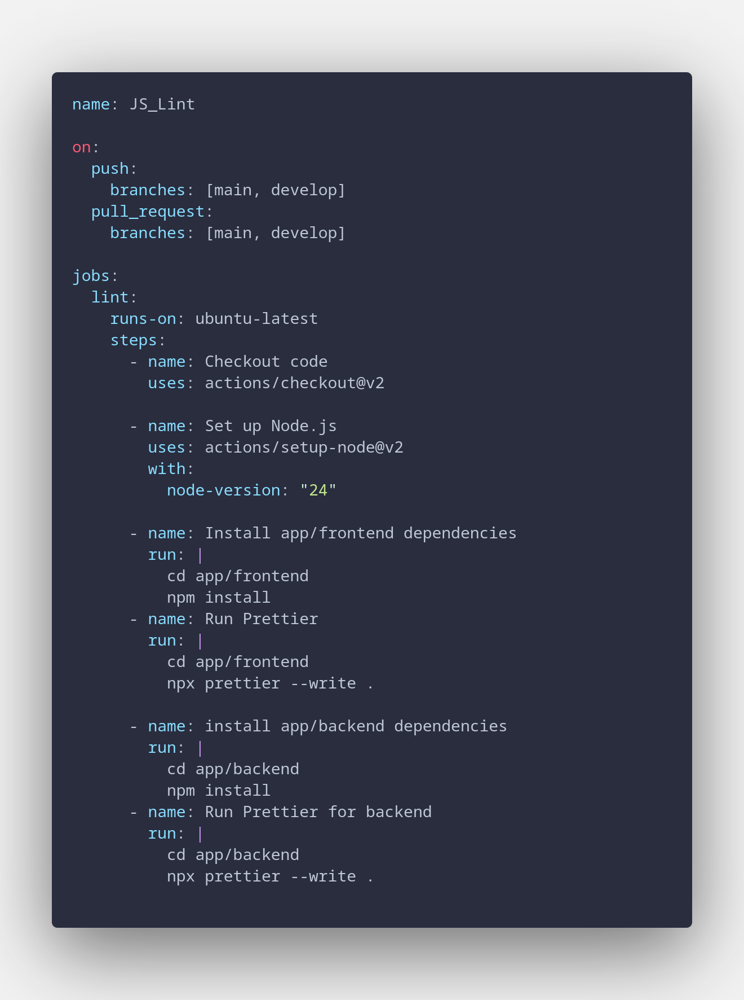

# Como nosso processo de Lintagem funciona

Primeiramente, nossa Lintagem funciona utilizando Prettier, uma funcionalidade nativa npx que roda de forma muitissimo parecida com o nosso ESLint.

o processo automatizado se encontra em .github/workflow/Lint.yml, e este é o código

note que se trata de um código extremamente simples, tudo que ele faz é dividido em etapas, ou steps, em que cada etapa está descrita corretamente.

checkout code faz o checkout do código, set up node.js faz a instalação do node na versão fornecida na máquina virtual (rodando ubuntu, aliás), install frontend dependencies faz exatamente o que diz, assim como install backend dependencies, tal qual suas contrapartes de run prettier.
