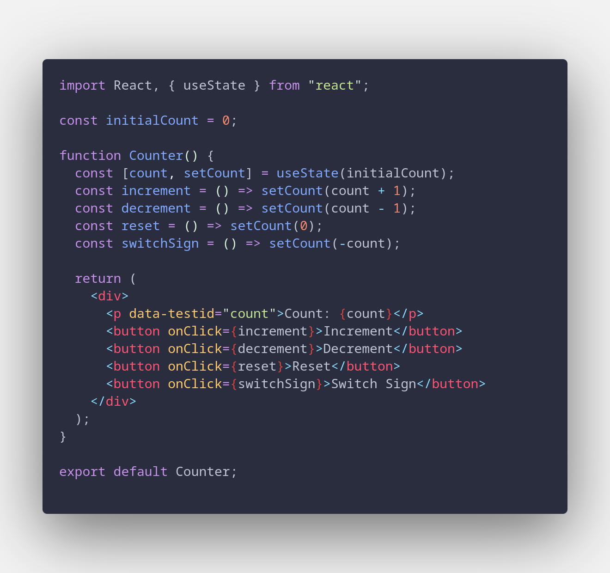

# Como funciona o sistema de testes que utilizamos

primeiramente, utilizamos o Jest como forma de fazer testes com o uso de npm run tests, este comando procura todos os arquivos que seguem a lógica de nomenclatura "(nome).test.(linguagem de prog)".

para podermos utilizar um .test, precisamos de algumas lógicas primordialmente, eu fiz um placeholder.jsx e um .test.js para ele, que se encontram a seguir:

Código:

Teste:

como é possível inferir, placeholder.jsx se trata de um contador básico com ações como revert, swapSign além de increment e decrement.

a única função testada no exemplo é se, quando a página for renderizada, ela vai ser renderizada com 0 após count.

outra parte importante de se notar é o "data-testid", ele serve para indeicar aonde que o teste vai procurar pelo que ele está esperando.

Mais uma coisa importante (principalmente para pessoas do frontend) é a presença do Babel nas dependencias, isso se trata de um conversor de JS pra JSX, já que o jest funciona primordialmente utilizando JS.

## Automação, como funciona

ele simplesmente instala a máquina e roda npm run tests em ambas as áreas do código (backend/frontend)

frontend:

Backend:

