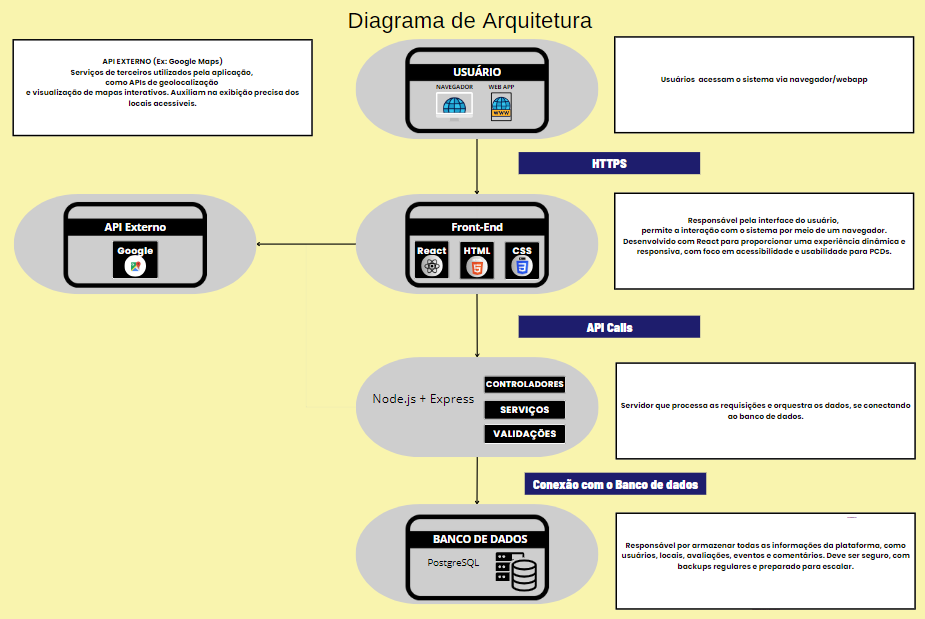
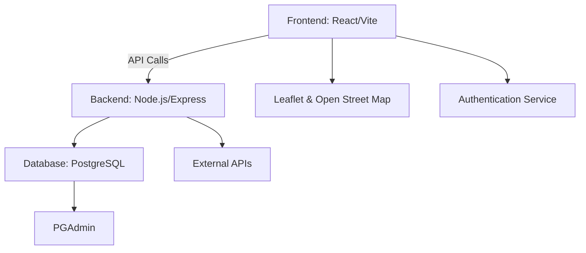

# 📊 Diagrama da Arquitetura do Sistema

Abaixo está representada a arquitetura geral do sistema **Mapa da Acessibilidade**, que descreve como os componentes se comunicam para fornecer funcionalidades acessíveis e eficientes.

---

## 🖼️ Visão Geral do Diagrama

---

---

## 🧩 Componentes da Arquitetura

### 👤 Usuário

- Os usuários acessam o sistema por meio de navegadores ou WebApps.
- O público-alvo inclui pessoas com deficiência (PCDs), sendo a acessibilidade um foco central da aplicação.

---

### 🎨 Front-End

- **Tecnologias:** React, HTML, CSS.
- É a interface gráfica que interage diretamente com o usuário.
- Desenvolvido com foco em acessibilidade, usabilidade e responsividade.
- Comunicação com o back-end ocorre via **HTTPS**.

---

### 🌐 API Externo

- **Exemplo:** Google Maps API.
- Utilizado para geolocalização e exibição de mapas interativos.
- Auxilia na exibição precisa de locais acessíveis no mapa.

---

### 🔧 Back-End (Node.js + Express)

- Atua como intermediário entre o front-end e o banco de dados.
- Processa requisições, realiza validações, chama serviços e aplica regras de negócio.
- Composto por três camadas principais:
  - **Controladores**
  - **Serviços**
  - **Validações**

---

### 🛢️ Banco de Dados

- **Tecnologia:** PostgreSQL.
- Armazena todas as informações do sistema, incluindo:
  - Usuários
  - Locais
  - Avaliações
  - Eventos
  - Comentários
- O banco é projetado para ser seguro, com backups regulares e preparado para escalabilidade.

---

## 🔁 Fluxo de Comunicação

1. O **usuário** acessa a aplicação pelo navegador.
2. O **front-end** envia requisições via **HTTPS** para a API.
3. A **API (Node.js/Express)**:
   - Valida e processa os dados.
   - Comunica-se com o **banco de dados** e, se necessário, com **APIs externas**.
4. A resposta retorna ao front-end e é exibida ao usuário.

---

## 🔒 Segurança

- Toda a comunicação entre front-end e back-end ocorre via **HTTPS**.
- A aplicação segue boas práticas de segurança e privacidade dos dados dos usuários.

---

## 📎 Relacionado

- [Visão Geral da Arquitetura](visao-geral.md)
- [Esquema do Banco de Dados](esquema-banco.md)
- [Fluxo de Dados](fluxo-de-dados.md)
