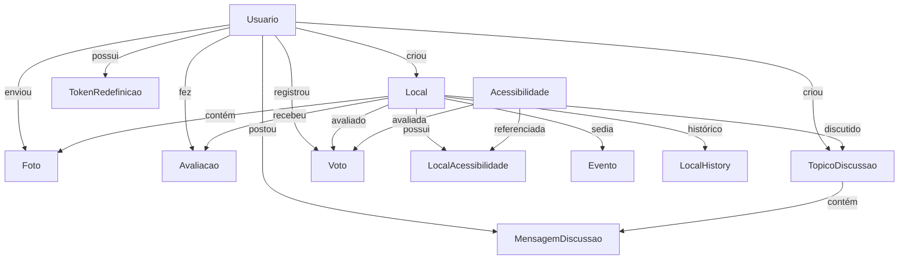
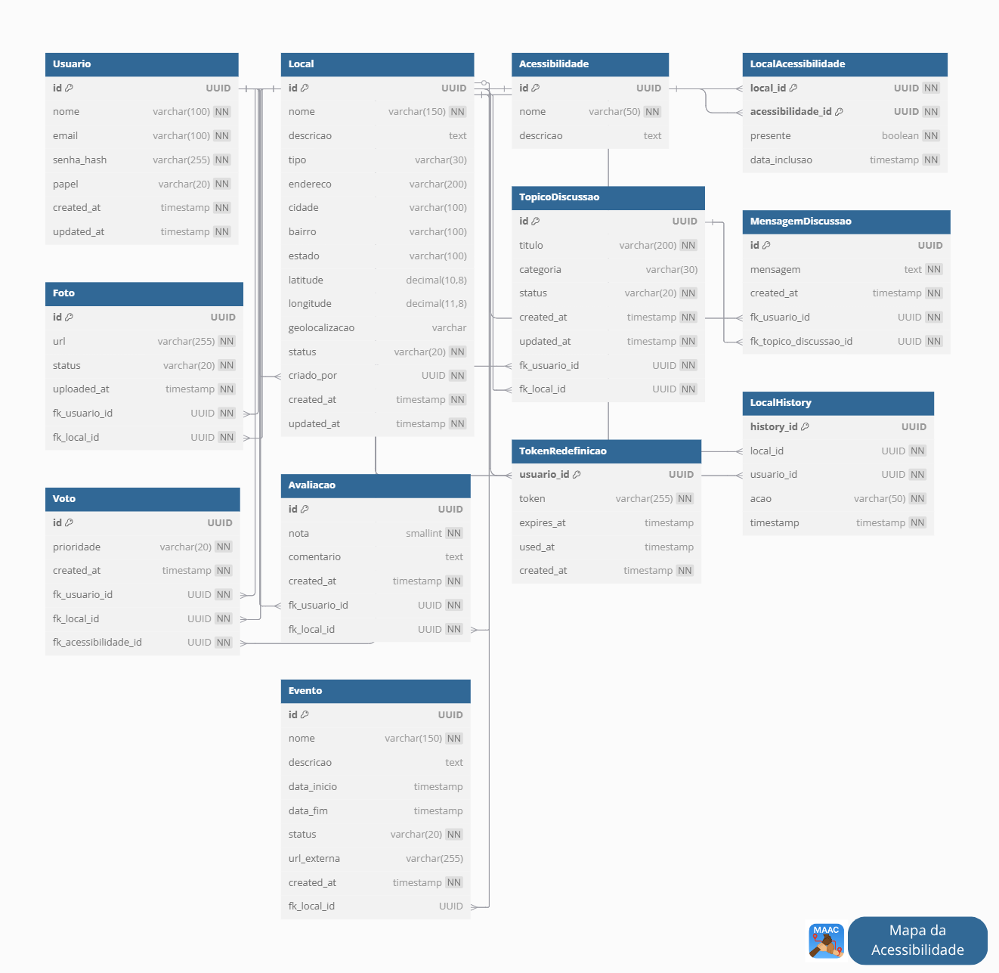

## Mapa Mental

---

## Esquema

---

## Funcionamento

Este banco de dados foi criado para gerenciar locais acessíveis e informações relacionadas a eles.

## 💡 Conceito Principal
Imagine um sistema onde:
- **Usuários** cadastram **locais** (como lojas, restaurantes, prédios)
- Esses locais são avaliados quanto à **acessibilidade** (facilidade para pessoas com deficiência)
- A comunidade pode discutir e avaliar cada local

## 👥 Principais Personagens

1. **Usuários**: Pessoas que usam o sistema (comuns, moderadores e administradores)
2. **Locais**: Estabelecimentos cadastrados no sistema
3. **Acessibilidades**: Itens que tornam um local acessível (rampas, banheiros adaptados, etc.)

## ✨ Funcionalidades Principais

### 1. Cadastro de Locais
- Cada local tem:
  - Nome, endereço, tipo (restaurante, loja, etc.)
  - Posição no mapa (latitude/longitude)
  - Status (pendente ou aprovado)

### 2. Avaliação de Acessibilidade
- Os locais são avaliados quanto a:
  - Itens de acessibilidade que possuem (rampas, elevadores, etc.)
  - Notas de 1 a 5 dadas pelos usuários
  - Votos sobre quais melhorias são mais importantes

### 3. Comunidade
- Usuários podem:
  - Criar tópicos de discussão sobre os locais
  - Trocar mensagens nesses tópicos
  - Adicionar fotos dos locais

### 4. Eventos
- Locais podem hospedar eventos com:
  - Datas de início e fim
  - Descrição e status (planejado, em andamento)

## 🔄 Como as Coisas se Conectam

1. Um **usuário** cadastra um **local**
2. O local recebe avaliações e fotos de vários usuários
3. O sistema registra quais itens de acessibilidade o local tem
4. Usuários votam nos itens mais importantes
5. Discussões são criadas sobre cada local

## 📱 Analogia com Aplicativos
Pense em aplicativos voltados para localização, como encontrar um local bem avaliado, ou próximo de onde você mora, mas focado especificamente em acessibilidade, onde:
- Qualquer pessoa pode adicionar locais
- A comunidade avalia quão acessível cada lugar é
- Todos podem discutir e sugerir melhorias

## 💾 O que o Banco de Dados Guarda
- Informações de cadastro (usuários e locais)
- Relações entre locais e seus recursos de acessibilidade
- Histórico de alterações nos locais
- Todas as avaliações, fotos e discussões

Este sistema ajuda a construir uma comunidade consciente sobre acessibilidade, tornando mais fácil para todos encontrar locais que atendam às suas necessidades!