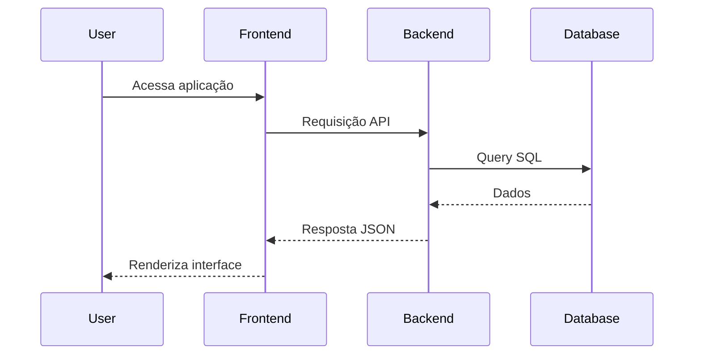

# 🔄 Fluxo de Dados da Aplicação

Abaixo está o fluxo de dados principal da aplicação, desde o momento em que o usuário acessa o sistema até o carregamento da interface com dados vindos do banco de dados.

