# 🔄 Fluxo de Dados da Aplicação

Abaixo está o fluxo de dados principal da aplicação, desde o momento em que o usuário acessa o sistema até o carregamento da interface com dados vindos do banco de dados.

```mermaid
sequenceDiagram
    participant User
    participant Frontend
    participant Backend
    participant Database

    User->>Frontend: Acessa aplicação
    Frontend->>Backend: Requisição API
    Backend->>Database: Query SQL
    Database-->>Backend: Dados
    Backend-->>Frontend: Resposta JSON
    Frontend-->>User: Renderiza interface
```

