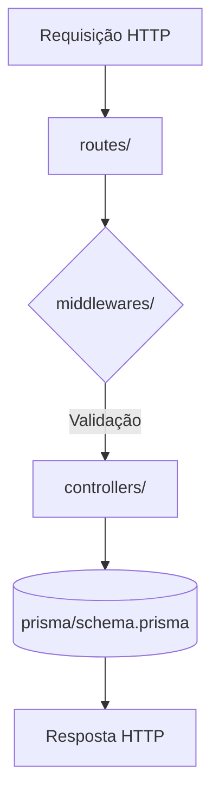

```plaintext
backend/
├── API-SWAGGER/
│   ├── swaggerComponents.js    # Componentes reutilizáveis da documentação Swagger/OpenAPI
│   └── swaggerConfig.js        # Configuração principal da documentação da API
│
├── db/
│   ├── .env.example            # Template de variáveis de ambiente para banco de dados
│   ├── readmedb.md             # Documentação do banco de dados
│   └── schema.sql              # Esquema SQL do banco de dados
│
├── prisma/
│   └── schema.prisma          # Schema do ORM Prisma (definição de modelos)
│
├── src/
│   ├── controllers/           # Lógica de negócio
│   │   ├── acessibilidadeController.js      # Controller de tipos de acessibilidade
│   │   ├── acessibilidadeLocalController.js # Controller de relação locais-acessibilidade  
│   │   ├── avaliacaoLocalController.js      # Controller de avaliações de locais
│   │   ├── fotosController.js               # Controller de upload de fotos
│   │   ├── locaisController.js              # Controller de cadastro de locais
│   │   └── usuariosController.js            # Controller de usuários
│   │
│   ├── middlewares/           # Camadas intermediárias
│   │   ├── authMiddleware.js       # Autenticação JWT
│   │   ├── errorMiddleware.js      # Tratamento de erros
│   │   ├── loginMiddleware.js      # Lógica de login
│   │   └── validationMiddleware.js # Validação de dados
│   │
│   ├── routes/                # Definição de rotas
│   │   ├── acessibilidadeLocalRouter.js # Rotas de acessibilidade-local
│   │   ├── acessibilidadeRouter.js      # Rotas de tipos de acessibilidade
│   │   ├── avaliacaoLocalRouter.js      # Rotas de avaliações
│   │   ├── fotosRouter.js               # Rotas de fotos
│   │   ├── locaisRouter.js              # Rotas de locais
│   │   └── usuariosRoutes.js            # Rotas de usuários
│   │
│   ├── jest.config.js         # Configuração de testes
│   └── server.js              # Ponto de entrada da aplicação
│
├── .gitignore                # Arquivos ignorados pelo Git
├── babel.config.json         # Configuração do Babel (transpilação JS)
├── eslint.config.js          # Configuração do ESLint (linting)
├── jest.config.js            # Configuração global de testes
├── package-lock.json         # Versões exatas de dependências
├── package.json              # Dependências e scripts do projeto
└── README.md                 # Documentação básica do projeto
```

# Estrutura do Backend - Explicação Organizacional

## 📂 API-SWAGGER/
| Arquivo | Finalidade |
|---------|------------|
| `swaggerComponents.js` | Componentes reutilizáveis para documentação Swagger/OpenAPI |
| `swaggerConfig.js` | Configuração principal da documentação da API |

**Por quê?**  
Centraliza a documentação da API em formato padrão, permitindo autoatualização conforme o código evolui.

## 🗃️ db/
| Arquivo | Finalidade |
|---------|------------|
| `.env.example` | Template para variáveis de ambiente do banco de dados |
| `readmedb.md` | Documentação do esquema e operações do banco |
| `schema.sql` | Script SQL completo da estrutura do banco |

**Por quê?**  
Mantém toda a configuração e documentação do banco em um local único e organizado.

## ⚙️ prisma/
| Arquivo | Finalidade |
|---------|------------|
| `schema.prisma` | Definição dos modelos de dados via ORM Prisma |

**Por quê?**  
Segrega a camada de acesso a dados usando um ORM moderno com type-safety.

## 💻 src/
### 🎛️ controllers/
| Arquivo | Responsabilidade |
|---------|------------------|
| `*Controller.js` | Lógica de negócio para cada entidade |
| `*Controller.test.js` | Testes unitários dos controllers |

**Por quê?**  
Isola as regras de negócio em módulos especializados por domínio.

### 🔄 middlewares/
| Arquivo | Função |
|---------|--------|
| `authMiddleware.js` | Autenticação JWT |
| `errorMiddleware.js` | Tratamento centralizado de erros |
| `validationMiddleware.js` | Validação de dados de entrada |

**Por quê?**  
Centraliza comportamentos transversais aplicáveis a múltiplas rotas.

### 🛣️ routes/
| Arquivo | Propósito |
|---------|-----------|
| `*Router.js` | Definição de endpoints HTTP para cada recurso |

**Por quê?**  
Separa o roteamento da lógica de negócio, seguindo boas práticas REST.

## ⚡ Arquivos Raiz
| Arquivo | Importância |
|---------|-------------|
| `.gitignore` | Padrão Node.js para ignorar arquivos |
| `package.json` | Dependências e scripts do projeto |
| `README.md` | Documentação essencial do projeto |

**Por quê?**  
Seguem convenções universais do ecossistema Node.js.

## Diagrama de Fluxo
