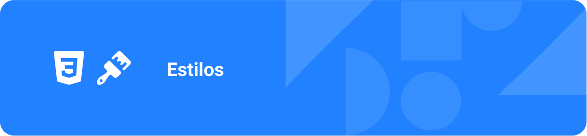

## 🖌️ | 📝  Cadastro

O arquivo `Cadastro.css` localizado em (`src/pages/Cadastro.css`) define toda a estilização visual da página de cadastro de usuários do frontend do projeto **Mapa da Acessibilidade**.

**Função e contexto**

Este arquivo foi desenvolvido para garantir que o formulário de cadastro seja moderno, acessível, responsivo e agradável de usar. Ele contribui diretamente para a experiência do usuário, tornando o processo de criação de conta mais intuitivo e visualmente alinhado à identidade do sistema.

```css
/* Arquivo: src/pages/Cadastro.css */

/* 
  Centraliza o formulário de cadastro na tela, com fundo suave e padding.
*/
.register-container {
  display: flex;
  align-items: center;
  justify-content: center;
  min-height: 100vh;
  background-color: #f8fafc;
  padding: 20px;
}

/* 
  Cartão principal do formulário, com fundo branco, bordas arredondadas e sombra.
*/
.register-card {
  background: white;
  border-radius: 16px;
  box-shadow: 0 4px 6px -1px rgba(0, 0, 0, 0.1), 0 2px 4px -1px rgba(0, 0, 0, 0.06);
  padding: 32px;
  width: 100%;
  max-width: 400px;
}

/* 
  Cabeçalho do formulário, centralizado.
*/
.register-header {
  text-align: center;
  margin-bottom: 32px;
}

/* 
  Ícone ilustrativo do topo do formulário.
*/
.register-icon {
  display: flex;
  align-items: center;
  justify-content: center;
  width: 80px;
  height: 80px;
  background: linear-gradient(135deg, #dbeafe 0%, #bfdbfe 100%);
  border-radius: 50%;
  margin: 0 auto 24px;
  color: #3b82f6;
}

.register-icon svg {
  width: 40px;
  height: 40px;
}

/* 
  Título e subtítulo do formulário.
*/
.register-title {
  font-size: 24px;
  font-weight: 700;
  color: #1f2937;
  margin: 0 0 8px;
}

.register-subtitle {
  font-size: 14px;
  color: #6b7280;
  margin: 0;
}

/* 
  Link para login ou outras páginas, com cor de destaque e efeito hover.
*/
.register-link {
  color: #3b82f6;
  text-decoration: none;
  font-weight: 500;
}

.register-link:hover {
  color: #1d4ed8;
}

/* 
  Espaçamento inferior do formulário.
*/
.register-form {
  margin-bottom: 24px;
}

/* 
  Grupo de campos do formulário.
*/
.form-group {
  margin-bottom: 16px;
}

/* 
  Wrapper para campos de entrada com ícones.
*/
.input-wrapper {
  position: relative;
  display: flex;
  align-items: center;
}

/* 
  Ícone à esquerda do campo de entrada.
*/
.input-icon {
  position: absolute;
  left: 12px;
  width: 20px;
  height: 20px;
  color: #9ca3af;
  z-index: 1;
}

/* 
  Campo de entrada principal.
*/
.form-input {
  width: 100%;
  padding: 12px 12px 12px 44px;
  border: 1px solid #d1d5db;
  border-radius: 8px;
  font-size: 16px;
  color: #374151;
  background: white;
  transition: border-color 0.2s ease-in-out;
}

/* 
  Destaque ao focar no campo de entrada.
*/
.form-input:focus {
  outline: none;
  border-color: #3b82f6;
  box-shadow: 0 0 0 3px rgba(59, 130, 246, 0.1);
}

.form-input::placeholder {
  color: #9ca3af;
}

/* 
  Ícone à direita do campo de entrada (ex: mostrar senha).
*/
.input-flag {
  position: absolute;
  right: 12px;
  font-size: 16px;
}

/* 
  Botão para alternar exibição da senha.
*/
.toggle-password {
  position: absolute;
  right: 12px;
  background: none;
  border: none;
  cursor: pointer;
  color: #9ca3af;
  padding: 0;
  display: flex;
  align-items: center;
  justify-content: center;
}

.toggle-password:hover {
  color: #6b7280;
}

.toggle-password svg {
  width: 20px;
  height: 20px;
}

/* 
  Grupo de checkbox para aceite dos termos.
*/
.checkbox-group {
  margin: 20px 0;
}

.checkbox-wrapper {
  display: flex;
  align-items: flex-start;
  gap: 8px;
}

.checkbox {
  width: 16px;
  height: 16px;
  margin: 0;
  flex-shrink: 0;
  margin-top: 2px;
}

.checkbox-label {
  font-size: 14px;
  color: #374151;
  line-height: 1.5;
}

.terms-link {
  color: #3b82f6;
  text-decoration: none;
}

.terms-link:hover {
  text-decoration: underline;
}

/* 
  Botão principal de cadastro.
*/
.register-button {
  width: 100%;
  background: #3b82f6;
  color: white;
  border: none;
  border-radius: 8px;
  padding: 12px 16px;
  font-size: 16px;
  font-weight: 500;
  cursor: pointer;
  display: flex;
  align-items: center;
  justify-content: center;
  gap: 8px;
  transition: background-color 0.2s ease-in-out;
}

.register-button:hover {
  background: #1d4ed8;
}

.register-button svg {
  width: 20px;
  height: 20px;
}

/* 
  Divisor visual entre cadastro tradicional e social.
*/
.divider {
  position: relative;
  text-align: center;
  margin: 24px 0;
}

.divider::before {
  content: '';
  position: absolute;
  top: 50%;
  left: 0;
  right: 0;
  height: 1px;
  background: #e5e7eb;
}

.divider span {
  background: white;
  color: #9ca3af;
  padding: 0 16px;
  font-size: 14px;
  position: relative;
  z-index: 1;
}

/* 
  Botões de cadastro social (Facebook, Google, Apple).
*/
.social-buttons {
  display: grid;
  grid-template-columns: repeat(3, 1fr);
  gap: 12px;
}

.social-button {
  display: flex;
  align-items: center;
  justify-content: center;
  padding: 12px;
  border: 1px solid #d1d5db;
  border-radius: 8px;
  background: white;
  cursor: pointer;
  transition: all 0.2s ease-in-out;
}

.social-button:hover {
  background: #f9fafb;
  border-color: #9ca3af;
}

.social-button svg {
  width: 20px;
  height: 20px;
}

.social-button.facebook svg {
  color: #1877f2;
}

.social-button.google svg {
  color: #ea4335;
}

.social-button.apple svg {
  color: #000000;
}

/* 
  Responsividade para telas pequenas.
*/
@media (max-width: 480px) {
  .register-container {
    padding: 16px;
  }
  
  .register-card {
    padding: 24px;
  }
  
  .register-icon {
    width: 60px;
    height: 60px;
  }
  
  .register-icon svg {
    width: 30px;
    height: 30px;
  }
  
  .register-title {
    font-size: 20px;
  }
}
```

**Principais características e classes**

- **Layout centralizado e responsivo:**  
  `.register-container` centraliza o formulário vertical e horizontalmente, ocupando toda a altura da tela, com fundo suave e padding adaptativo para diferentes tamanhos de dispositivo.

- **Cartão de cadastro:**  
  `.register-card` define o bloco principal do formulário, com fundo branco, bordas arredondadas, sombra para destaque e largura máxima para boa leitura em qualquer tela.

- **Cabeçalho e ícone:**  
  `.register-header`, `.register-icon`, `.register-title`, `.register-subtitle` estilizam o topo do formulário, incluindo ícone ilustrativo, título e subtítulo, reforçando a identidade visual.

- **Campos de formulário:**  
  `.form-group`, `.input-wrapper`, `.form-input`, `.input-icon`, `.toggle-password` organizam e estilizam os campos de entrada, garantindo espaçamento, ícones alinhados, feedback visual ao focar e botões para exibir/ocultar senha.

- **Checkbox de termos:**  
  `.checkbox-group`, `.checkbox-wrapper`, `.checkbox`, `.checkbox-label`, `.terms-link` garantem alinhamento, legibilidade e acessibilidade para o aceite dos termos de uso e política de privacidade.

- **Botão de cadastro:**  
  `.register-button` estiliza o botão principal, com cor de destaque, bordas arredondadas, fonte em negrito e efeito hover para melhor interação.

- **Divisor e cadastro social:**  
  `.divider`, `.social-buttons`, `.social-button` organizam a separação entre cadastro tradicional e social, com botões para Facebook, Google e Apple, cada um com cor e ícone característicos.

- **Responsividade:**  
  Media queries ajustam paddings, tamanhos de ícones e fontes para telas menores, garantindo boa usabilidade em dispositivos móveis.

**Resumo**

O arquivo `Cadastro.css` é essencial para proporcionar uma experiência de cadastro agradável, acessível e alinhada ao design do **Mapa da Acessibilidade**. Ele garante que o formulário seja visualmente atraente, fácil de usar e adaptado a qualquer dispositivo, contribuindo para a inclusão e o engajamento de novos usuários na plataforma.

---

## 🖌️ | 📞 Contato

O arquivo `Contato.css` localizado na pasta (`src/pages/Contato.css`) define toda a estilização visual da página de contato do frontend do projeto **Mapa da Acessibilidade**.

**Função e contexto**

Este arquivo foi desenvolvido para garantir que a página de contato seja moderna, acessível, responsiva e agradável de usar. Ele contribui diretamente para a experiência do usuário, tornando o envio de mensagens e a visualização das informações institucionais mais intuitivos e visualmente alinhados à identidade do sistema.

```css

/* Arquivo: (`src/pages/Contato.css`)*/

/* 
  Define altura mínima para a área principal da página de contato,
  garantindo que ocupe toda a altura da tela.
*/
.contact-main {
  min-height: 100vh;
}

/* 
  Seção principal da página de contato, com espaçamento vertical e fundo suave.
*/
.contact-section {
  padding: 4rem 0 6rem;
  background-color: #f8fafc;
}

/* 
  Container centralizado e responsivo para o conteúdo da página de contato.
  Ajusta o padding conforme o tamanho da tela.
*/
.contact-container {
  max-width: 1200px;
  margin: 0 auto;
  padding: 0 1rem;
}
@media (min-width: 640px) {
  .contact-container {
    padding: 0 1.5rem;
  }
}
@media (min-width: 1024px) {
  .contact-container {
    padding: 0 2rem;
  }
}

/* 
  Cabeçalho da página de contato, centralizado e com espaçamento inferior.
*/
.contact-header {
  text-align: center;
  margin-bottom: 4rem;
}

/* 
  Wrapper para o título e ícone do cabeçalho.
*/
.contact-title-wrapper {
  display: flex;
  align-items: center;
  justify-content: center;
  margin-bottom: 1rem;
}

/* 
  Ícone do cabeçalho, com cor de destaque.
*/
.contact-icon {
  height: 2rem;
  width: 2rem;
  color: #3b82f6;
  margin-right: 0.75rem;
}

/* 
  Título principal da página de contato.
*/
.contact-title {
  font-size: 2.25rem;
  font-weight: bold;
  color: #1f2937;
  margin: 0;
}
@media (min-width: 768px) {
  .contact-title {
    font-size: 2.5rem;
  }
}

/* 
  Subtítulo da página de contato.
*/
.contact-subtitle {
  font-size: 1.25rem;
  color: #4b5563;
  max-width: 48rem;
  margin: 0 auto;
  line-height: 1.6;
}

/* 
  Grid principal do conteúdo, adaptando para uma ou duas colunas conforme a tela.
*/
.contact-content {
  display: grid;
  grid-template-columns: 1fr;
  gap: 3rem;
}
@media (min-width: 1024px) {
  .contact-content {
    grid-template-columns: 1fr 1fr;
  }
}

/* 
  Título da seção de informações institucionais.
*/
.contact-info-title {
  font-size: 1.5rem;
  font-weight: bold;
  color: #1f2937;
  margin-bottom: 2rem;
}

/* 
  Grid de cartões de informações institucionais.
*/
.contact-info-grid {
  display: flex;
  flex-direction: column;
  gap: 1.5rem;
}

/* 
  Cartão de informação institucional, com fundo branco, bordas arredondadas e sombra.
*/
.contact-info-card {
  background: white;
  border-radius: 0.5rem;
  padding: 1.5rem;
  box-shadow: 0 1px 3px 0 rgba(0, 0, 0, 0.1), 0 1px 2px 0 rgba(0, 0, 0, 0.06);
  transition: box-shadow 0.2s ease-in-out;
}
.contact-info-card:hover {
  box-shadow: 0 4px 6px -1px rgba(0, 0, 0, 0.1), 0 2px 4px -1px rgba(0, 0, 0, 0.06);
}

/* 
  Conteúdo interno do cartão de informação, alinhando ícone e texto.
*/
.contact-info-content {
  display: flex;
  align-items: flex-start;
  gap: 1rem;
}

/* 
  Wrapper para o ícone do cartão de informação.
*/
.contact-info-icon-wrapper {
  width: 3rem;
  height: 3rem;
  background-color: #dbeafe;
  border-radius: 50%;
  display: flex;
  align-items: center;
  justify-content: center;
  flex-shrink: 0;
}

/* 
  Ícone do cartão de informação.
*/
.contact-info-icon {
  height: 1.5rem;
  width: 1.5rem;
  color: #3b82f6;
}

/* 
  Área de texto do cartão de informação.
*/
.contact-info-text {
  flex: 1;
}

/* 
  Título do cartão de informação.
*/
.contact-info-card-title {
  font-size: 1.125rem;
  font-weight: 600;
  color: #1f2937;
  margin: 0 0 0.5rem;
}

/* 
  Link de contato (e-mail, telefone), com efeito hover.
*/
.contact-info-link {
  color: #4b5563;
  text-decoration: none;
  white-space: pre-line;
  transition: color 0.2s ease-in-out;
}
.contact-info-link:hover {
  color: #1d4ed8;
}

/* 
  Descrição do cartão de informação.
*/
.contact-info-description {
  color: #4b5563;
  white-space: pre-line;
  margin: 0;
  line-height: 1.5;
}

/* 
  Cartão do formulário de contato, com fundo branco e sombra.
*/
.contact-form-card {
  background: white;
  border-radius: 0.5rem;
  box-shadow: 0 1px 3px 0 rgba(0, 0, 0, 0.1), 0 1px 2px 0 rgba(0, 0, 0, 0.06);
  overflow: hidden;
}

/* 
  Cabeçalho do formulário de contato.
*/
.contact-form-header {
  padding: 1.5rem 1.5rem 0;
}

/* 
  Título do formulário de contato.
*/
.contact-form-title {
  font-size: 1.5rem;
  color: #1f2937;
  font-weight: 600;
  margin: 0 0 0.5rem;
}

/* 
  Descrição do formulário de contato.
*/
.contact-form-description {
  color: #4b5563;
  margin: 0;
  line-height: 1.5;
}

/* 
  Conteúdo do formulário de contato.
*/
.contact-form-content {
  padding: 1.5rem;
}

/* 
  Estrutura do formulário, com espaçamento entre campos.
*/
.contact-form {
  display: flex;
  flex-direction: column;
  gap: 1.5rem;
}

/* 
  Linha de campos do formulário, adaptando para duas colunas em telas médias.
*/
.form-row {
  display: grid;
  grid-template-columns: 1fr;
  gap: 1rem;
}
@media (min-width: 768px) {
  .form-row {
    grid-template-columns: 1fr 1fr;
  }
}

/* 
  Grupo de campos do formulário.
*/
.form-group {
  display: flex;
  flex-direction: column;
}

/* 
  Rótulo dos campos do formulário.
*/
.form-label {
  display: block;
  font-size: 0.875rem;
  font-weight: 500;
  color: #374151;
  margin-bottom: 0.5rem;
}

/* 
  Campos de entrada e textarea do formulário.
*/
.form-input,
.form-textarea {
  width: 100%;
  padding: 0.75rem;
  border: 1px solid #d1d5db;
  border-radius: 0.375rem;
  font-size: 1rem;
  transition: border-color 0.2s ease-in-out, box-shadow 0.2s ease-in-out;
  background: white;
}

/* 
  Destaque ao focar nos campos do formulário.
*/
.form-input:focus,
.form-textarea:focus {
  outline: none;
  border-color: #3b82f6;
  box-shadow: 0 0 0 3px rgba(59, 130, 246, 0.1);
}

.form-input::placeholder,
.form-textarea::placeholder {
  color: #9ca3af;
}

/* 
  Textarea com redimensionamento vertical.
*/
.form-textarea {
  resize: vertical;
  min-height: 120px;
}

/* 
  Botão de envio do formulário, com cor de destaque e efeito hover.
*/
.form-submit-button {
  width: 100%;
  background-color: #3b82f6;
  color: white;
  padding: 0.75rem 1.5rem;
  font-size: 1.125rem;
  font-weight: 600;
  border: none;
  border-radius: 0.375rem;
  cursor: pointer;
  transition: background-color 0.2s ease-in-out;
  display: flex;
  align-items: center;
  justify-content: center;
  gap: 0.5rem;
}
.form-submit-button:hover {
  background-color: #1d4ed8;
}
.form-submit-button:focus {
  outline: none;
  box-shadow: 0 0 0 3px rgba(59, 130, 246, 0.3);
}

/* 
  Ícone do botão de envio.
*/
.submit-icon {
  height: 1.25rem;
  width: 1.25rem;
}

/* 
  Responsividade adicional para telas pequenas.
*/
@media (max-width: 640px) {
  .contact-section {
    padding: 2rem 0 3rem;
  }
  .contact-header {
    margin-bottom: 2rem;
  }
  .contact-title {
    font-size: 1.875rem;
  }
  .contact-subtitle {
    font-size: 1.125rem;
  }
  .contact-content {
    gap: 2rem;
  }
  .contact-info-card,
  .contact-form-header,
  .contact-form-content {
    padding: 1rem;
  }
}
```

**Principais características e classes**

- **Layout centralizado e responsivo:**  
  `.contact-section` e `.contact-container` organizam o conteúdo em uma largura máxima, centralizando e adaptando o layout para diferentes tamanhos de tela.

- **Cabeçalho e títulos:**  
  `.contact-header`, `.contact-title-wrapper`, `.contact-title`, `.contact-subtitle` estilizam o topo da página, incluindo ícone, título e subtítulo, reforçando a identidade visual e a clareza das informações.

- **Grid de conteúdo:**  
  `.contact-content` utiliza grid para dividir a área de informações institucionais e o formulário de contato, adaptando-se para uma ou duas colunas conforme o tamanho da tela.

- **Cartões de informação:**  
  `.contact-info-card`, `.contact-info-content`, `.contact-info-icon-wrapper`, `.contact-info-icon`, `.contact-info-card-title`, `.contact-info-link`, `.contact-info-description` organizam e estilizam os dados de contato (e-mail, telefone, endereço, horário), com ícones, títulos e links interativos.

- **Formulário de contato:**  
  `.contact-form-card`, `.contact-form-header`, `.contact-form-title`, `.contact-form-description`, `.contact-form-content`, `.contact-form` e `.form-group` estruturam o formulário, garantindo espaçamento, campos acessíveis e feedback visual ao focar.

- **Campos de formulário:**  
  `.form-label`, `.form-input`, `.form-textarea` garantem legibilidade, contraste e usabilidade nos campos de entrada e texto.

- **Botão de envio:**  
  `.form-submit-button` estiliza o botão principal do formulário, com cor de destaque, fonte em negrito, efeito hover e foco acessível.

- **Responsividade:**  
  Media queries ajustam paddings, tamanhos de fontes, espaçamentos e grid para telas menores, garantindo boa usabilidade em dispositivos móveis.

**Resumo**

O arquivo `Contato.css` é essencial para proporcionar uma experiência de contato agradável, acessível e alinhada ao design do **Mapa da Acessibilidade**. Ele garante que a página seja visualmente atraente, fácil de usar e adaptada a qualquer dispositivo, contribuindo para a comunicação eficiente entre usuários e a equipe do projeto.

---

## 🖌️ | 🏢 Eventos

O arquivo `Eventos.css` localizado em (`src/pages/Eventos.css`) define toda a estilização visual da página de eventos do frontend do projeto **Mapa da Acessibilidade**.

**Função e contexto**

Este arquivo foi desenvolvido para garantir que a página de eventos seja moderna, acessível, responsiva e visualmente atraente. Ele contribui diretamente para a experiência do usuário, tornando a navegação, visualização e participação em eventos mais intuitivas e alinhadas à identidade visual do sistema.

```css
/*
Arquivo: (src/pages/Eventos.css)
/*

/* 
  Seção principal da página de eventos, com espaçamento vertical e fundo branco.
*/
.events-section {
  padding: 4rem 0 6rem;
  background-color: #ffffff;
}

/* 
  Container centralizado e responsivo para o conteúdo da página de eventos.
  Ajusta o padding conforme o tamanho da tela.
*/
.events-container {
  max-width: 1200px;
  margin: 0 auto;
  padding: 0 1rem;
}
@media (min-width: 640px) {
  .events-container {
    padding: 0 1.5rem;
  }
}
@media (min-width: 1024px) {
  .events-container {
    padding: 0 2rem;
  }
}

/* 
  Cabeçalho da página de eventos, centralizado e com espaçamento inferior.
*/
.events-header {
  text-align: center;
  margin-bottom: 4rem;
}

/* 
  Wrapper para o título e ícone do cabeçalho.
*/
.events-title-wrapper {
  display: flex;
  align-items: center;
  justify-content: center;
  margin-bottom: 1rem;
}

/* 
  Ícone do título, com cor de destaque.
*/
.events-title-icon {
  height: 2rem;
  width: 2rem;
  color: #3b82f6;
  margin-right: 0.75rem;
}

/* 
  Título principal da página de eventos.
*/
.events-title {
  font-size: 2.25rem;
  font-weight: bold;
  color: #3b82f6;
  margin: 0;
}
@media (min-width: 768px) {
  .events-title {
    font-size: 2.5rem;
  }
}

/* 
  Subtítulo da página de eventos.
*/
.events-subtitle {
  font-size: 1.25rem;
  color: #6b7280;
  max-width: 48rem;
  margin: 0 auto;
  line-height: 1.6;
}

/* 
  Grid de eventos, adaptando para uma ou duas colunas conforme a tela.
*/
.events-grid {
  display: grid;
  grid-template-columns: 1fr;
  gap: 2rem;
  margin-bottom: 4rem;
}
@media (min-width: 768px) {
  .events-grid {
    grid-template-columns: repeat(2, 1fr);
  }
}

/* 
  Card individual de evento, com fundo branco, bordas arredondadas e sombra.
  Destaca ao passar o mouse.
*/
.event-card {
  background: white;
  border-radius: 0.75rem;
  border: 2px solid #e5e7eb;
  padding: 1.5rem;
  cursor: pointer;
  transition: all 0.3s ease;
  box-shadow: 0 1px 3px 0 rgba(0, 0, 0, 0.1), 0 1px 2px 0 rgba(0, 0, 0, 0.06);
}
.event-card:hover {
  border-color: #3b82f6;
  transform: translateY(-2px);
  box-shadow: 0 10px 25px 0 rgba(0, 0, 0, 0.1);
}

/* 
  Cabeçalho do card de evento.
*/
.event-card-header {
  margin-bottom: 1rem;
}

/* 
  Linha de badges de status do evento.
*/
.event-badges-row {
  display: flex;
  justify-content: space-between;
  align-items: flex-start;
  margin-bottom: 0.75rem;
  flex-wrap: wrap;
  gap: 0.5rem;
}

/* 
  Grupo de badges de status.
*/
.event-status-badges {
  display: flex;
  gap: 0.5rem;
  flex-wrap: wrap;
}

/* 
  Badge de status do evento.
*/
.event-badge {
  padding: 0.25rem 0.75rem;
  border-radius: 9999px;
  font-size: 0.75rem;
  font-weight: 500;
  display: inline-block;
}

/* 
  Cores específicas para cada tipo de evento e status.
*/
.event-badge-workshop {
  background-color: #dbeafe;
  color: #1e40af;
}
.event-badge-webinar {
  background-color: #d1fae5;
  color: #065f46;
}
.event-badge-acao {
  background-color: #fed7aa;
  color: #c2410c;
}
.event-badge-hackathon {
  background-color: #e9d5ff;
  color: #7c3aed;
}
.event-badge-free {
  background-color: transparent;
  color: #059669;
  border: 1px solid #059669;
}
.event-badge-online {
  background-color: transparent;
  color: #2563eb;
  border: 1px solid #2563eb;
}

/* 
  Título do card de evento.
*/
.event-card-title {
  font-size: 1.25rem;
  font-weight: 600;
  color: #1f2937;
  margin: 0;
  line-height: 1.4;
}

/* 
  Conteúdo do card de evento.
*/
.event-card-content {
  display: flex;
  flex-direction: column;
  gap: 1rem;
}

/* 
  Descrição do evento, com limite de linhas e overflow escondido.
*/
.event-description {
  color: #6b7280;
  margin: 0;
  line-height: 1.6;
  display: -webkit-box;
  -webkit-line-clamp: 3;
  -webkit-box-orient: vertical;
  overflow: hidden;
}

/* 
  Detalhes do evento (local, data, horário, etc).
*/
.event-details {
  display: flex;
  flex-direction: column;
  gap: 0.75rem;
}
.event-detail-item {
  display: flex;
  align-items: center;
  font-size: 0.875rem;
  color: #6b7280;
}
.event-detail-icon {
  height: 1rem;
  width: 1rem;
  margin-right: 0.5rem;
  color: #3b82f6;
  flex-shrink: 0;
}

/* 
  Ações do evento (botões de inscrição, detalhes, etc).
*/
.event-actions {
  display: flex;
  flex-direction: column;
  gap: 0.75rem;
}
@media (min-width: 640px) {
  .event-actions {
    flex-direction: row;
  }
}

/* 
  Botões de ação dos eventos.
*/
.event-btn {
  padding: 0.75rem 1.5rem;
  border-radius: 0.375rem;
  font-weight: 500;
  border: none;
  cursor: pointer;
  transition: all 0.2s ease;
  display: flex;
  align-items: center;
  justify-content: center;
  text-decoration: none;
  font-size: 0.875rem;
}
.event-btn-primary {
  background-color: #3b82f6;
  color: white;
  flex: 1;
}
.event-btn-primary:hover {
  background-color: #2563eb;
}
.event-btn-secondary {
  background-color: transparent;
  color: #3b82f6;
  border: 1px solid #3b82f6;
}
.event-btn-secondary:hover {
  background-color: #3b82f6;
  color: white;
}
.event-btn-icon {
  height: 1rem;
  width: 1rem;
  margin-right: 0.5rem;
}

/* 
  Barra de progresso de vagas do evento.
*/
.event-progress-wrapper {
  margin-top: 0.5rem;
}
.event-progress-bar {
  width: 100%;
  background-color: #e5e7eb;
  border-radius: 9999px;
  height: 0.5rem;
  overflow: hidden;
}
.event-progress-fill {
  background-color: #3b82f6;
  height: 100%;
  border-radius: 9999px;
  transition: width 0.3s ease;
}
.event-progress-text {
  font-size: 0.75rem;
  color: #6b7280;
  margin: 0.25rem 0 0 0;
}

/* 
  Seção de chamada para ação (CTA) ao final da página de eventos.
*/
.events-cta-wrapper {
  text-align: center;
}
.events-cta {
  background: linear-gradient(135deg, #3b82f6 0%, #1d4ed8 100%);
  border-radius: 1rem;
  padding: 2rem;
  color: white;
}
.events-cta-title {
  font-size: 1.875rem;
  font-weight: bold;
  margin: 0 0 1rem 0;
}
@media (min-width: 768px) {
  .events-cta-title {
    font-size: 2.25rem;
  }
}
.events-cta-description {
  font-size: 1.125rem;
  margin: 0 0 1.5rem 0;
  opacity: 0.9;
  max-width: 32rem;
  margin-left: auto;
  margin-right: auto;
  line-height: 1.6;
}
.events-cta-buttons {
  display: flex;
  flex-direction: column;
  gap: 1rem;
  justify-content: center;
  align-items: center;
}
@media (min-width: 640px) {
  .events-cta-buttons {
    flex-direction: row;
  }
}
.events-cta-btn {
  background-color: white;
  color: #3b82f6;
  padding: 0.75rem 1.5rem;
  font-weight: 600;
  border-radius: 0.375rem;
  border: none;
  cursor: pointer;
  transition: all 0.2s ease;
  text-decoration: none;
  font-size: 1rem;
}
.events-cta-btn:hover {
  background-color: #f3f4f6;
  transform: translateY(-1px);
}

/* 
  Ajustes responsivos para telas pequenas.
*/
@media (max-width: 639px) {
  .events-section {
    padding: 2rem 0 4rem;
  }
  .events-header {
    margin-bottom: 2rem;
  }
  .events-title {
    font-size: 1.875rem;
  }
  .events-subtitle {
    font-size: 1.125rem;
  }
  .event-card {
    padding: 1rem;
  }
  .events-cta {
    padding: 1.5rem;
  }
  .events-cta-title {
    font-size: 1.5rem;
  }
  .events-cta-description {
    font-size: 1rem;
  }
}
```

**Principais características e classes**

- **Layout centralizado e responsivo:**  
  `.events-section` e `.events-container` organizam o conteúdo em uma largura máxima, centralizando e adaptando o layout para diferentes tamanhos de tela.

- **Cabeçalho e títulos:**  
  `.events-header`, `.events-title-wrapper`, `.events-title`, `.events-title-icon`, `.events-subtitle` estilizam o topo da página, incluindo ícone, título e subtítulo, reforçando a identidade visual e a clareza das informações.

- **Grid de eventos:**  
  `.events-grid` organiza os cards de eventos em uma ou duas colunas, adaptando-se ao tamanho da tela para garantir boa visualização em dispositivos móveis e desktops.

- **Cards de evento:**  
  `.event-card` estiliza cada evento individualmente, com fundo branco, bordas arredondadas, sombra e efeito de destaque ao passar o mouse.  
  `.event-card-header`, `.event-badges-row`, `.event-status-badges`, `.event-badge`, `.event-card-title`, `.event-card-content`, `.event-description`, `.event-details`, `.event-detail-item`, `.event-detail-icon` organizam e destacam as informações de cada evento, como tipo, status, descrição, local, data, horário e participantes.

- **Badges de status:**  
  Classes como `.event-badge-workshop`, `.event-badge-webinar`, `.event-badge-acao`, `.event-badge-hackathon`, `.event-badge-free`, `.event-badge-online` aplicam cores e estilos distintos para cada tipo de evento e status, facilitando a identificação visual.

- **Ações e botões:**  
  `.event-actions`, `.event-btn`, `.event-btn-primary`, `.event-btn-secondary`, `.event-btn-icon` estilizam os botões de inscrição, detalhes e outras ações, com cores de destaque e efeitos de interação.

- **Barra de progresso:**  
  `.event-progress-wrapper`, `.event-progress-bar`, `.event-progress-fill`, `.event-progress-text` exibem visualmente o preenchimento de vagas de cada evento, promovendo engajamento.

- **Seção de chamada para ação (CTA):**  
  `.events-cta-wrapper`, `.events-cta`, `.events-cta-title`, `.events-cta-description`, `.events-cta-buttons`, `.events-cta-btn` destacam a área para incentivar a organização de novos eventos, com visual marcante e botões de ação.

- **Responsividade:**  
  Media queries ajustam paddings, tamanhos de fontes, espaçamentos, grid e botões para telas menores, garantindo boa usabilidade em dispositivos móveis.

**Resumo**

O arquivo `Eventos.css` é fundamental para proporcionar uma experiência de navegação e participação em eventos agradável, acessível e alinhada ao design do **Mapa da Acessibilidade**. Ele garante que a página de eventos seja visualmente atraente, fácil de usar e adaptada a qualquer dispositivo, promovendo o engajamento da comunidade e a divulgação de ações inclusivas.

---

## 🖌️ | ❓ FAQ 

O arquivo `FAQ.css` localizado em (`src/pages/FAQ.css`) define toda a estilização visual da página de perguntas frequentes (FAQ) do frontend do projeto **Mapa da Acessibilidade**.

**Função e contexto**

Este arquivo foi desenvolvido para garantir que a página de FAQ seja moderna, acessível, responsiva e fácil de navegar. Ele contribui diretamente para a experiência do usuário, tornando a busca por informações e esclarecimento de dúvidas mais intuitivos e visualmente alinhados à identidade do sistema.

```css
/* Arquivo (`src/pages/FAQ.css`) */

/* 
  Seção principal da FAQ, com espaçamento vertical, fundo suave e altura mínima de tela cheia.
*/
.faq-section {
  padding: 64px 0 96px;
  background-color: #f8fafc;
  min-height: 100vh;
}

/* 
  Container centralizado e responsivo para o conteúdo da FAQ.
  Ajusta o padding conforme o tamanho da tela.
*/
.faq-container {
  max-width: 896px;
  margin: 0 auto;
  padding: 0 16px;
}
@media (min-width: 640px) {
  .faq-container {
    padding: 0 24px;
  }
}
@media (min-width: 1024px) {
  .faq-container {
    padding: 0 32px;
  }
}

/* 
  Cabeçalho da FAQ, centralizado e com espaçamento inferior.
*/
.faq-header {
  text-align: center;
  margin-bottom: 64px;
}

/* 
  Wrapper para o título e ícone do cabeçalho.
*/
.faq-title-wrapper {
  display: flex;
  align-items: center;
  justify-content: center;
  margin-bottom: 16px;
}

/* 
  Ícone do título, com cor de destaque.
*/
.faq-icon {
  height: 32px;
  width: 32px;
  color: #3b82f6;
  margin-right: 12px;
}

/* 
  Título principal da FAQ.
*/
.faq-title {
  font-size: 1.875rem;
  font-weight: 700;
  color: #1e40af;
  margin: 0;
}
@media (min-width: 768px) {
  .faq-title {
    font-size: 2.25rem;
  }
}

/* 
  Subtítulo da FAQ.
*/
.faq-subtitle {
  font-size: 1.25rem;
  color: #6b7280;
  max-width: 768px;
  margin: 0 auto;
  line-height: 1.6;
}

/* 
  Accordion de perguntas e respostas.
*/
.faq-accordion {
  display: flex;
  flex-direction: column;
  gap: 16px;
}

/* 
  Item do accordion, com fundo branco, bordas arredondadas e sombra.
*/
.faq-item {
  background-color: white;
  border-radius: 12px;
  border: 1px solid #e5e7eb;
  box-shadow: 0 1px 3px 0 rgba(0, 0, 0, 0.1), 0 1px 2px 0 rgba(0, 0, 0, 0.06);
  overflow: hidden;
  transition: box-shadow 0.2s ease-in-out;
}
.faq-item.active {
  box-shadow: 0 10px 15px -3px rgba(0, 0, 0, 0.1), 0 4px 6px -2px rgba(0, 0, 0, 0.05);
}

/* 
  Botão de pergunta do accordion.
*/
.faq-question {
  width: 100%;
  padding: 24px;
  text-align: left;
  background: none;
  border: none;
  cursor: pointer;
  display: flex;
  justify-content: space-between;
  align-items: center;
  transition: background-color 0.2s ease-in-out;
}
.faq-question:hover {
  background-color: #f9fafb;
}
.faq-question:focus {
  outline: 2px solid #3b82f6;
  outline-offset: -2px;
}

/* 
  Texto da pergunta.
*/
.faq-question-text {
  font-size: 1.125rem;
  font-weight: 600;
  color: #1e40af;
  margin: 0;
  padding-right: 16px;
  line-height: 1.5;
}

/* 
  Ícone de chevron para expandir/recolher a resposta.
*/
.faq-chevron {
  color: #6b7280;
  transition: transform 0.2s ease-in-out;
  flex-shrink: 0;
}
.faq-item.active .faq-chevron {
  transform: rotate(180deg);
}

/* 
  Área da resposta, com transição de altura.
*/
.faq-answer {
  max-height: 0;
  overflow: hidden;
  transition: max-height 0.3s ease-in-out;
}
.faq-answer.expanded {
  max-height: 500px;
}

/* 
  Conteúdo da resposta, com espaçamento interno.
*/
.faq-answer-content {
  padding: 0 24px 24px;
}
.faq-answer-content p {
  color: #374151;
  line-height: 1.7;
  margin: 0;
  font-size: 1rem;
}

/* 
  Seção de chamada para ação (CTA) ao final da FAQ.
*/
.faq-cta {
  text-align: center;
  margin-top: 64px;
}
.faq-cta-content {
  background-color: white;
  border-radius: 12px;
  padding: 32px;
  box-shadow: 0 10px 15px -3px rgba(0, 0, 0, 0.1), 0 4px 6px -2px rgba(0, 0, 0, 0.05);
}
.faq-cta-title {
  font-size: 1.5rem;
  font-weight: 700;
  color: #1e40af;
  margin: 0 0 16px 0;
}
.faq-cta-text {
  color: #6b7280;
  margin: 0 0 24px 0;
  font-size: 1rem;
  line-height: 1.6;
}
.faq-cta-buttons {
  display: flex;
  flex-direction: column;
  gap: 16px;
  justify-content: center;
  align-items: center;
}
@media (min-width: 640px) {
  .faq-cta-buttons {
    flex-direction: row;
  }
}
.faq-button {
  display: inline-flex;
  align-items: center;
  justify-content: center;
  padding: 12px 24px;
  font-size: 1rem;
  font-weight: 600;
  border-radius: 8px;
  text-decoration: none;
  transition: all 0.2s ease-in-out;
  cursor: pointer;
  min-width: 160px;
}
.faq-button-outline {
  border: 2px solid #3b82f6;
  color: #3b82f6;
  background-color: transparent;
}
.faq-button-outline:hover {
  background-color: #3b82f6;
  color: white;
}
.faq-button-outline:focus {
  outline: 2px solid #1d4ed8;
  outline-offset: 2px;
}

/* 
  Ajustes responsivos para telas pequenas.
*/
@media (max-width: 640px) {
  .faq-section {
    padding: 48px 0 72px;
  }
  .faq-header {
    margin-bottom: 48px;
  }
  .faq-title-wrapper {
    flex-direction: column;
    gap: 8px;
  }
  .faq-icon {
    margin-right: 0;
  }
  .faq-title {
    font-size: 1.5rem;
  }
  .faq-subtitle {
    font-size: 1.125rem;
  }
  .faq-question {
    padding: 20px;
  }
  .faq-question-text {
    font-size: 1rem;
  }
  .faq-answer-content {
    padding: 0 20px 20px;
  }
  .faq-cta {
    margin-top: 48px;
  }
  .faq-cta-content {
    padding: 24px;
  }
}

/* 
  Melhoria de acessibilidade para usuários que preferem menos animações.
*/
@media (prefers-reduced-motion: reduce) {
  .faq-item,
  .faq-question,
  .faq-chevron,
  .faq-answer,
  .faq-button {
    transition: none;
  }
}

/* 
  Suporte a modo de alto contraste para acessibilidade.
*/
@media (prefers-contrast: high) {
  .faq-item {
    border: 2px solid #000;
  }
  .faq-question-text {
    color: #000;
  }
  .faq-answer-content p {
    color: #000;
  }
}
```

**Principais características e classes**

- **Layout centralizado e responsivo:**  
  `.faq-section` e `.faq-container` organizam o conteúdo em uma largura máxima, centralizando e adaptando o layout para diferentes tamanhos de tela.

- **Cabeçalho e títulos:**  
  `.faq-header`, `.faq-title-wrapper`, `.faq-title`, `.faq-icon`, `.faq-subtitle` estilizam o topo da página, incluindo ícone, título e subtítulo, reforçando a identidade visual e a clareza das informações.

- **Accordion de perguntas:**  
  `.faq-accordion`, `.faq-item`, `.faq-question`, `.faq-answer`, `.faq-answer-content` estruturam o sistema de perguntas e respostas em formato de acordeão, permitindo expandir e recolher cada item de forma acessível e com transições suaves.

- **Acessibilidade:**  
  O CSS inclui melhorias para navegação por teclado, foco visível, suporte a modo de alto contraste e redução de movimento para usuários que preferem menos animações.

- **Chamada para ação (CTA):**  
  `.faq-cta`, `.faq-cta-content`, `.faq-cta-title`, `.faq-cta-text`, `.faq-cta-buttons`, `.faq-button`, `.faq-button-outline` destacam a seção de contato ao final da página, incentivando o usuário a buscar suporte caso não encontre sua dúvida.

- **Responsividade:**  
  Media queries ajustam paddings, tamanhos de fontes, espaçamentos e grid para telas menores, garantindo boa usabilidade em dispositivos móveis.

**Resumo**

O arquivo `FAQ.css` é fundamental para proporcionar uma experiência de consulta de dúvidas agradável, acessível e alinhada ao design do **Mapa da Acessibilidade**. Ele garante que a página de FAQ seja visualmente atraente, fácil de usar e adaptada a qualquer dispositivo, promovendo autonomia e suporte eficiente aos usuários da plataforma.

---

## 🖌️ | 🏠 Home

O arquivo `Home.css` localizado em (`src/pages/Home.css`) define toda a estilização visual da página inicial do frontend do projeto **Mapa da Acessibilidade**.

**Função e contexto**

Este arquivo foi desenvolvido para garantir que a página inicial seja moderna, acessível, responsiva e visualmente atraente. Ele contribui diretamente para a experiência do usuário, tornando a navegação pelo mapa, aplicação de filtros, visualização de detalhes dos locais e interação com a interface mais intuitivas e alinhadas à identidade visual do sistema.

```css
/* Arquivo: (src/pages/Home.css) */

/* 
  Container principal da página Home, ocupa toda a largura e altura da tela,
  esconde overflow e serve de base para o layout.
*/
.home-container {
  width: 100%;
  height: 100vh;
  overflow: hidden;
  position: relative;
}

/* 
  Conteúdo principal da Home, usa flexbox para organizar mapa e sidebar,
  ocupa toda a área disponível.
*/
.main-content {
  display: flex;
  width: 100%;
  height: 100%;
  position: relative;
}

/* Sidebar de Filtros: fundo branco, borda à direita, sombra e transição suave. */
.filters-sidebar {
  background: white;
  border-right: 1px solid #e5e7eb;
  transition: all 0.3s ease;
  z-index: 1000;
  position: relative;
  box-shadow: 2px 0 10px rgba(0, 0, 0, 0.1);
}

/* Sidebar aberta: largura padrão de 320px. */
.filters-open {
  width: 320px;
  min-width: 320px;
}

/* Sidebar fechada: largura reduzida para 60px. */
.filters-closed {
  width: 60px;
  min-width: 60px;
}

/* Cabeçalho da sidebar de filtros, com padding, borda inferior e alinhamento dos itens. */
.filters-header {
  padding: 1rem;
  border-bottom: 1px solid #e5e7eb;
  display: flex;
  justify-content: space-between;
  align-items: center;
}

/* Título da sidebar de filtros, com transição de opacidade. */
.filters-title {
  font-size: 1.25rem;
  font-weight: 600;
  color: #374151;
  margin: 0;
  transition: opacity 0.3s ease;
}

/* Esconde o título quando a sidebar está fechada. */
.filters-closed .filters-title {
  opacity: 0;
  visibility: hidden;
}

/* Botão para abrir/fechar a sidebar de filtros. */
.filters-toggle {
  background: none;
  border: none;
  cursor: pointer;
  padding: 0.5rem;
  border-radius: 0.375rem;
  transition: background-color 0.2s;
}

.filters-toggle:hover {
  background-color: #f3f4f6;
}

/* Conteúdo da sidebar de filtros, com rolagem vertical e transição de opacidade. */
.filters-content {
  padding: 1rem;
  overflow-y: auto;
  height: calc(100vh - 80px);
  transition: opacity 0.3s ease;
}

/* Esconde o conteúdo quando a sidebar está fechada. */
.filters-closed .filters-content {
  opacity: 0;
  visibility: hidden;
}

/* Seção de filtros, com espaçamento inferior. */
.filter-section {
  margin-bottom: 2rem;
}

/* Título de cada seção de filtro, com ícone, fonte destacada e linha inferior. */
.filter-section-title {
  display: flex;
  align-items: center;
  gap: 0.5rem;
  font-size: 1rem;
  font-weight: 600;
  color: #374151;
  margin-bottom: 1rem;
  padding-bottom: 0.5rem;
  border-bottom: 1px solid #e5e7eb;
}

/* Item de filtro, alinhando checkbox e label. */
.filter-item {
  display: flex;
  align-items: center;
  margin-bottom: 0.75rem;
}

/* Checkbox do filtro, com espaçamento à direita. */
.filter-checkbox {
  margin-right: 0.75rem;
  width: 1rem;
  height: 1rem;
}

/* Label do filtro, com ícone e fonte menor. */
.filter-label {
  display: flex;
  align-items: center;
  font-size: 0.875rem;
  color: #374151;
  cursor: pointer;
  gap: 0.5rem;
}

/* Ícone do filtro, com variações de cor para cada tipo. */
.filter-icon {
  width: 1rem;
  height: 1rem;
}

.filter-icon-blue { color: #3b82f6; }
.filter-icon-green { color: #10b981; }
.filter-icon-yellow { color: #f59e0b; }
.filter-icon-purple { color: #8b5cf6; }
.filter-icon-orange { color: #f97316; }

/* Seção de Distância */
.distance-section {
  margin-bottom: 2rem;
}

.distance-container {
  padding: 1rem;
  background-color: #f9fafb;
  border-radius: 0.5rem;
}

.distance-label {
  font-weight: 600;
  color: #374151;
  display: block;
  margin-bottom: 1rem;
}

.distance-slider-container {
  margin-bottom: 0.5rem;
}

.distance-slider {
  width: 100%;
  height: 0.5rem;
  background: #d1d5db;
  outline: none;
  border-radius: 0.25rem;
  cursor: pointer;
}

.distance-markers {
  display: flex;
  justify-content: space-between;
  font-size: 0.75rem;
  color: #6b7280;
}

/* Seção de Avaliação */
.rating-section {
  margin-bottom: 2rem;
}

.rating-container {
  padding: 1rem;
  background-color: #f9fafb;
  border-radius: 0.5rem;
}

.rating-label {
  font-weight: 600;
  color: #374151;
  display: block;
  margin-bottom: 1rem;
}

.rating-options {
  display: flex;
  flex-direction: column;
  gap: 0.75rem;
}

.rating-item {
  display: flex;
  align-items: center;
}

.rating-radio {
  margin-right: 0.75rem;
}

.rating-option-label {
  display: flex;
  align-items: center;
  font-size: 0.875rem;
  color: #374151;
  cursor: pointer;
}

.stars-container {
  display: flex;
  margin-right: 0.5rem;
}

.star {
  width: 1rem;
  height: 1rem;
  margin-right: 0.125rem;
}

.star-filled {
  color: #fbbf24;
}

.star-empty {
  color: #d1d5db;
}

/* Botão Aplicar Filtros */
.apply-filters-section {
  margin-top: 2rem;
}

.apply-filters-btn {
  width: 100%;
  background-color: #3b82f6;
  color: white;
  border: none;
  padding: 0.75rem 1rem;
  border-radius: 0.5rem;
  font-weight: 600;
  cursor: pointer;
  display: flex;
  align-items: center;
  justify-content: center;
  transition: background-color 0.2s;
}

.apply-filters-btn:hover {
  background-color: #2563eb;
}

.btn-icon {
  margin-right: 0.5rem;
}

/* Container do Mapa com Pesquisa */
.map-container {
  flex: 1;
  position: relative;
  transition: all 0.3s ease;
  display: flex;
  flex-direction: column;
}

.map-with-sidebar {
  width: calc(100% - 320px);
}

/* Barra de Pesquisa */
.search-container {
  position: absolute;
  top: 1rem;
  left: 1rem;
  right: 1rem;
  z-index: 1000;
}

.search-bar {
  display: flex;
  align-items: center;
  background: white;
  border-radius: 0.5rem;
  box-shadow: 0 4px 6px -1px rgba(0, 0, 0, 0.1), 0 2px 4px -1px rgba(0, 0, 0, 0.06);
  border: 1px solid #e5e7eb;
  overflow: hidden;
}

.search-icon {
  margin-left: 1rem;
  color: #6b7280;
  flex-shrink: 0;
}

.search-input {
  flex: 1;
  padding: 0.75rem 1rem;
  border: none;
  outline: none;
  font-size: 0.875rem;
  color: #374151;
}

.search-input::placeholder {
  color: #9ca3af;
}

.search-filters-btn {
  padding: 0.75rem 1rem;
  background: none;
  border: none;
  color: #6b7280;
  cursor: pointer;
  transition: background-color 0.2s;
  border-left: 1px solid #e5e7eb;
}

.search-filters-btn:hover {
  background-color: #f9fafb;
  color: #374151;
}

.leaflet-map {
  height: 100%;
  width: 100%;
  flex: 1;
}

/* Drawer de Informações */
.info-drawer {
  position: fixed;
  top: 0;
  right: 0;
  height: 100vh;
  background: white;
  border-left: 1px solid #e5e7eb;
  z-index: 1001;
  transition: transform 0.3s ease;
  box-shadow: -2px 0 10px rgba(0, 0, 0, 0.1);
  width: 400px;
  overflow-y: auto;
}

.drawer-open {
  transform: translateX(0);
}

.drawer-closed {
  transform: translateX(100%);
}

.drawer-content {
  padding: 1.5rem;
}

.drawer-header {
  display: flex;
  justify-content: space-between;
  align-items: center;
  margin-bottom: 1.5rem;
  padding-bottom: 1rem;
  border-bottom: 1px solid #e5e7eb;
}

.drawer-title {
  font-size: 1.5rem;
  font-weight: 700;
  color: #111827;
  margin: 0;
}

.drawer-close-btn {
  background: none;
  border: none;
  cursor: pointer;
  padding: 0.5rem;
  border-radius: 0.375rem;
  transition: background-color 0.2s;
}

.drawer-close-btn:hover {
  background-color: #f3f4f6;
}

/* Avaliação */
.rating-display {
  display: flex;
  align-items: center;
  margin-bottom: 1.5rem;
}

.stars-rating {
  position: relative;
  display: flex;
  margin-right: 0.75rem;
}

.stars-background,
.stars-foreground {
  display: flex;
}

.stars-background {
  color: #d1d5db;
}

.stars-foreground {
  position: absolute;
  top: 0;
  left: 0;
  overflow: hidden;
  color: #fbbf24;
}

.rating-text {
  font-size: 0.875rem;
  color: #6b7280;
}

/* Score de Acessibilidade */
.accessibility-score {
  margin-bottom: 1.5rem;
  padding: 1rem;
  background-color: #f0f9ff;
  border-radius: 0.5rem;
  border: 1px solid #e0f2fe;
}

.accessibility-header {
  display: flex;
  justify-content: space-between;
  align-items: center;
  margin-bottom: 0.5rem;
  font-weight: 600;
  color: #0369a1;
}

.score {
  font-size: 1.125rem;
  font-weight: 700;
}

.accessibility-bar {
  width: 100%;
  height: 0.5rem;
  background-color: #e0f2fe;
  border-radius: 0.25rem;
  overflow: hidden;
}

.accessibility-fill {
  height: 100%;
  background: linear-gradient(to right, #f59e0b, #10b981);
  transition: width 0.3s ease;
}

/* Lista de Features */
.features-list {
  display: flex;
  flex-wrap: wrap;
  gap: 0.5rem;
  margin-bottom: 1.5rem;
}

.feature-tag {
  display: flex;
  align-items: center;
  padding: 0.375rem 0.75rem;
  border-radius: 9999px;
  font-size: 0.75rem;
  font-weight: 500;
}

.feature-icon {
  width: 1rem;
  height: 1rem;
  margin-right: 0.375rem;
}

.feature-ramp {
  background-color: #dbeafe;
  color: #1e40af;
}

.feature-bathroom {
  background-color: #dcfce7;
  color: #166534;
}

.feature-tactile {
  background-color: #fef3c7;
  color: #92400e;
}

.feature-elevator {
  background-color: #ede9fe;
  color: #6b21a8;
}

.feature-default {
  background-color: #f3f4f6;
  color: #374151;
}

/* Seções de Informações */
.info-sections {
  margin-bottom: 1.5rem;
}

.info-item {
  display: flex;
  align-items: flex-start;
  margin-bottom: 1rem;
  padding: 1rem;
  background-color: #f9fafb;
  border-radius: 0.5rem;
}

.info-icon {
  width: 2.5rem;
  height: 2.5rem;
  border-radius: 0.5rem;
  display: flex;
  align-items: center;
  justify-content: center;
  margin-right: 0.75rem;
  flex-shrink: 0;
}

.info-icon-blue {
  background-color: #dbeafe;
  color: #1e40af;
}

.info-icon-green {
  background-color: #dcfce7;
  color: #166534;
}

.info-icon-purple {
  background-color: #ede9fe;
  color: #6b21a8;
}

.info-text {
  flex: 1;
}

.info-title {
  font-weight: 600;
  color: #111827;
  margin: 0 0 0.25rem 0;
}

.info-subtitle {
  color: #6b7280;
  font-size: 0.875rem;
  margin: 0.125rem 0;
}

/* Seção de Descrição */
.description-section {
  margin-bottom: 1.5rem;
}

.section-title {
  font-size: 1.125rem;
  font-weight: 600;
  color: #111827;
  margin: 0 0 0.75rem 0;
}

.description-text {
  color: #4b5563;
  line-height: 1.6;
  margin: 0;
}

/* Seção de Fotos */
.photos-section {
  margin-bottom: 1.5rem;
}

.photos-grid {
  display: grid;
  grid-template-columns: repeat(2, 1fr);
  gap: 0.5rem;
}

.photo-item {
  aspect-ratio: 1;
  overflow: hidden;
  border-radius: 0.5rem;
}

.photo-image {
  width: 100%;
  height: 100%;
  object-fit: cover;
  transition: transform 0.2s;
}

.photo-image:hover {
  transform: scale(1.05);
}

/* Botões de Ação */
.action-buttons {
  display: flex;
  gap: 0.75rem;
}

.action-btn {
  flex: 1;
  display: flex;
  align-items: center;
  justify-content: center;
  padding: 0.75rem 1rem;
  border-radius: 0.5rem;
  font-weight: 600;
  cursor: pointer;
  transition: all 0.2s;
  border: none;
}

.action-btn-primary {
  background-color: #3b82f6;
  color: white;
}

.action-btn-primary:hover {
  background-color: #2563eb;
}

.action-btn-secondary {
  background-color: white;
  color: #374151;
  border: 1px solid #d1d5db;
}

.action-btn-secondary:hover {
  background-color: #f9fafb;
}

/* Features adicionais */
.feature-wheelchair {
  background-color: #dbeafe;
  color: #1e40af;
}

.feature-audio {
  background-color: #fef3c7;
  color: #92400e;
}

.feature-braille {
  background-color: #fed7aa;
  color: #c2410c;
}

/* Responsividade para telas menores */
@media (max-width: 768px) {
  .filters-sidebar {
    position: fixed;
    left: 0;
    top: 0;
    height: 100vh;
    z-index: 1002;
  }
  
  .filters-closed {
    transform: translateX(-100%);
    width: 320px;
  }
  
  .map-container {
    width: 100% !important;
  }
  
  .search-container {
    left: 0.5rem;
    right: 0.5rem;
  }
  
  .info-drawer {
    width: 100%;
    max-width: 400px;
  }
  
  .photos-grid {
    grid-template-columns: 1fr;
  }
  
  .action-buttons {
    flex-direction: column;
  }
}

@media (max-width: 480px) {
  .drawer-content {
    padding: 1rem;
  }
  
  .drawer-title {
    font-size: 1.25rem;
  }
  
  .info-item {
    padding: 0.75rem;
  }
  
  .filters-content {
    padding: 0.75rem;
  }
  
  .search-bar {
    border-radius: 0.375rem;
  }
  
  .search-input {
    padding: 0.625rem 0.75rem;
    font-size: 0.75rem;
  }
  
  .search-filters-btn {
    padding: 0.625rem 0.75rem;
  }
}
```

**Principais características e classes**

- **Layout principal e responsivo:**  
  `.home-container` e `.main-content` organizam o layout em tela cheia, centralizando o conteúdo e adaptando para diferentes tamanhos de dispositivo.

- **Sidebar de filtros:**  
  `.filters-sidebar`, `.filters-open`, `.filters-closed`, `.filters-header`, `.filters-title`, `.filters-toggle`, `.filters-content` controlam a exibição, animação e responsividade da barra lateral de filtros, permitindo ao usuário filtrar locais por recursos de acessibilidade, distância e avaliação.

- **Seções de filtro:**  
  `.filter-section`, `.filter-section-title`, `.filter-item`, `.filter-checkbox`, `.filter-label`, `.filter-icon` e variantes de cor organizam e destacam os diferentes tipos de filtros disponíveis.

- **Filtros de distância e avaliação:**  
  `.distance-section`, `.distance-container`, `.distance-label`, `.distance-slider`, `.distance-markers`, `.rating-section`, `.rating-container`, `.rating-label`, `.rating-options`, `.stars-container`, `.star-filled`, `.star-empty` estilizam os controles de distância e avaliação mínima.

- **Botão de aplicar filtros:**  
  `.apply-filters-section`, `.apply-filters-btn`, `.btn-icon` garantem destaque e acessibilidade ao botão de aplicação dos filtros.

- **Mapa interativo:**  
  `.map-container`, `.map-with-sidebar`, `.leaflet-map` controlam o posicionamento e responsividade do mapa exibido na página.

- **Barra de pesquisa:**  
  `.search-container`, `.search-bar`, `.search-icon`, `.search-input`, `.search-filters-btn` estilizam a barra de busca, tornando-a acessível e integrada ao layout.

- **Drawer de informações:**  
  `.info-drawer`, `.drawer-open`, `.drawer-closed`, `.drawer-content`, `.drawer-header`, `.drawer-title`, `.drawer-close-btn` controlam a exibição do painel lateral com detalhes do local selecionado no mapa.

- **Avaliação e score de acessibilidade:**  
  `.rating-display`, `.stars-rating`, `.stars-background`, `.stars-foreground`, `.rating-text`, `.accessibility-score`, `.accessibility-header`, `.score`, `.accessibility-bar`, `.accessibility-fill` exibem avaliações e indicadores visuais de acessibilidade dos locais.

- **Lista de features e informações:**  
  `.features-list`, `.feature-tag`, `.feature-icon`, `.feature-ramp`, `.feature-bathroom`, `.feature-tactile`, `.feature-elevator`, `.feature-default`, `.info-sections`, `.info-item`, `.info-icon`, `.info-title`, `.info-subtitle` organizam e destacam os recursos de acessibilidade e informações detalhadas dos locais.

- **Seção de fotos:**  
  `.photos-section`, `.photos-grid`, `.photo-item`, `.photo-image` organizam a exibição de imagens dos locais, com responsividade e efeito de destaque ao passar o mouse.

- **Botões de ação:**  
  `.action-buttons`, `.action-btn`, `.action-btn-primary`, `.action-btn-secondary` estilizam os botões para ações rápidas, como traçar rota ou avaliar local.

- **Responsividade:**  
  Media queries garantem que todos os elementos se adaptem a diferentes tamanhos de tela, tornando a experiência fluida em dispositivos móveis e desktops.

**Resumo**

O arquivo `Home.css` é fundamental para proporcionar uma experiência de navegação, busca e visualização de locais acessíveis agradável, acessível e alinhada ao design do **Mapa da Acessibilidade**. Ele garante que a página inicial seja visualmente atraente, fácil de usar e adaptada a qualquer dispositivo, promovendo a inclusão e a colaboração entre os usuários da plataforma.

---

## 🖌️ | 🔑 Login

O arquivo `Login.css` localizado em (`src/pages/Login.css`) define toda a estilização visual da página de login do frontend do projeto **Mapa da Acessibilidade**.

**Função e contexto**

Este arquivo foi desenvolvido para garantir que a página de login seja moderna, acessível, responsiva e agradável de usar. Ele contribui diretamente para a experiência do usuário, tornando o processo de autenticação mais intuitivo, seguro e visualmente alinhado à identidade do sistema.

```css
/* Arquivo: (`src/pages/Login.css`)  */

/* 
  Container principal da página de login.
  Centraliza o conteúdo vertical e horizontalmente, ocupa toda a altura da tela,
  aplica fundo suave e padding responsivo.
*/
.login-container {
  min-height: 100vh;
  display: flex;
  align-items: center;
  justify-content: center;
  padding: 3rem 1rem;
  background: #f8fafc;
}

/* 
  Cartão principal do formulário de login.
  Fundo branco, bordas arredondadas, sombra e largura máxima para boa leitura.
*/
.login-card {
  width: 100%;
  max-width: 28rem;
  background: white;
  border-radius: 1rem;
  box-shadow: 0 10px 25px -5px rgba(0, 0, 0, 0.1), 0 4px 6px -2px rgba(0, 0, 0, 0.05);
  padding: 2rem;
}

/* 
  Cabeçalho do formulário de login, centralizado.
*/
.login-header {
  text-align: center;
  margin-bottom: 2rem;
}

/* 
  Ícone ilustrativo do topo do formulário de login.
*/
.login-icon {
  width: 5rem;
  height: 5rem;
  margin: 0 auto 1rem;
  background: #dbeafe;
  border-radius: 50%;
  display: flex;
  align-items: center;
  justify-content: center;
  color: #2563eb;
}

.login-icon svg {
  width: 2.5rem;
  height: 2.5rem;
}

/* 
  Título e subtítulo do formulário de login.
*/
.login-title {
  font-size: 1.875rem;
  font-weight: 700;
  color: #1f2937;
  margin-bottom: 0.5rem;
}

.login-subtitle {
  color: #6b7280;
  font-size: 0.875rem;
}

/* 
  Link para cadastro ou outras páginas, com cor de destaque e efeito hover.
*/
.login-link {
  color: #2563eb;
  font-weight: 500;
  text-decoration: none;
  transition: color 0.2s;
}

.login-link:hover {
  color: #1d4ed8;
}

/* 
  Formulário de login, com espaçamento entre os campos.
*/
.login-form {
  display: flex;
  flex-direction: column;
  gap: 1.5rem;
}

/* 
  Grupo de campos do formulário.
*/
.form-group {
  display: flex;
  flex-direction: column;
}

/* 
  Wrapper para campos de entrada com ícones.
*/
.input-wrapper {
  position: relative;
  display: flex;
  align-items: center;
}

/* 
  Ícone à esquerda do campo de entrada.
*/
.input-icon {
  position: absolute;
  left: 0.75rem;
  width: 1.25rem;
  height: 1.25rem;
  color: #9ca3af;
  z-index: 10;
}

/* 
  Campo de entrada principal.
*/
.form-input {
  width: 100%;
  padding: 0.875rem 0.75rem 0.875rem 2.75rem;
  border: 1px solid #d1d5db;
  border-radius: 0.5rem;
  font-size: 1rem;
  transition: all 0.2s;
  background: white;
}

/* 
  Destaque ao focar no campo de entrada.
*/
.form-input:focus {
  outline: none;
  border-color: #2563eb;
  box-shadow: 0 0 0 3px rgba(37, 99, 235, 0.1);
}

.form-input::placeholder {
  color: #9ca3af;
}

/* 
  Ícone à direita do campo de entrada (ex: mostrar senha).
*/
.input-flag {
  position: absolute;
  right: 2.5rem;
  font-size: 1rem;
}

/* 
  Botão para alternar exibição da senha.
*/
.toggle-password {
  position: absolute;
  right: 0.75rem;
  background: none;
  border: none;
  cursor: pointer;
  color: #9ca3af;
  display: flex;
  align-items: center;
  justify-content: center;
  padding: 0.25rem;
  border-radius: 0.25rem;
  transition: color 0.2s;
}

.toggle-password:hover {
  color: #2563eb;
}

.toggle-password svg {
  width: 1.25rem;
  height: 1.25rem;
}

/* 
  Opções de login (lembrar de mim e esqueci a senha).
*/
.login-options {
  display: flex;
  justify-content: space-between;
  align-items: center;
  margin-top: -0.5rem;
}

/* 
  Wrapper para checkbox de "lembrar de mim".
*/
.checkbox-wrapper {
  display: flex;
  align-items: center;
  gap: 0.5rem;
}

.checkbox {
  width: 1rem;
  height: 1rem;
  accent-color: #2563eb;
}

.checkbox-label {
  font-size: 0.875rem;
  color: #4b5563;
  cursor: pointer;
}

/* 
  Link para recuperação de senha.
*/
.forgot-password {
  font-size: 0.875rem;
  color: #2563eb;
  text-decoration: none;
  font-weight: 500;
  transition: color 0.2s;
}

.forgot-password:hover {
  color: #1d4ed8;
}

/* 
  Botão principal de login.
*/
.login-button {
  width: 100%;
  padding: 0.875rem 1rem;
  background: #2563eb;
  color: white;
  border: none;
  border-radius: 0.5rem;
  font-size: 1rem;
  font-weight: 600;
  cursor: pointer;
  transition: all 0.2s;
  display: flex;
  align-items: center;
  justify-content: center;
  gap: 0.5rem;
  margin-top: 0.5rem;
}

.login-button:hover {
  background: #1d4ed8;
  transform: translateY(-1px);
  box-shadow: 0 4px 12px -2px rgba(37, 99, 235, 0.25);
}

.login-button svg {
  width: 1.25rem;
  height: 1.25rem;
}

/* 
  Divisor visual entre login tradicional e social.
*/
.divider {
  margin: 2rem 0 1.5rem;
  position: relative;
  text-align: center;
}

.divider::before {
  content: '';
  position: absolute;
  top: 50%;
  left: 0;
  right: 0;
  height: 1px;
  background: #e5e7eb;
  z-index: 1;
}

.divider span {
  background: white;
  padding: 0 1rem;
  color: #6b7280;
  font-size: 0.875rem;
  position: relative;
  z-index: 2;
}

/* 
  Botões de login social (Facebook, Google, Apple).
*/
.social-buttons {
  display: grid;
  grid-template-columns: repeat(3, 1fr);
  gap: 0.75rem;
}

.social-button {
  padding: 0.75rem;
  border: 1px solid #e5e7eb;
  background: white;
  border-radius: 0.5rem;
  cursor: pointer;
  transition: all 0.2s;
  display: flex;
  align-items: center;
  justify-content: center;
}

.social-button:hover {
  border-color: #d1d5db;
  transform: translateY(-1px);
  box-shadow: 0 4px 12px -2px rgba(0, 0, 0, 0.1);
}

.social-button svg {
  width: 1.25rem;
  height: 1.25rem;
}

.social-button.facebook svg {
  color: #1877f2;
}

.social-button.google svg {
  color: #ea4335;
}

.social-button.apple svg {
  color: #000000;
}

/* 
  Responsividade para telas pequenas.
*/
@media (max-width: 640px) {
  .login-container {
    padding: 1rem;
  }
  
  .login-card {
    padding: 1.5rem;
  }
  
  .login-title {
    font-size: 1.5rem;
  }
  
  .login-options {
    flex-direction: column;
    gap: 1rem;
    align-items: flex-start;
  }
}
```

**Principais características e classes**

- **Layout centralizado e responsivo:**  
  `.login-container` centraliza o formulário vertical e horizontalmente, ocupando toda a altura da tela, com fundo suave e padding adaptativo para diferentes tamanhos de dispositivo.

- **Cartão de login:**  
  `.login-card` define o bloco principal do formulário, com fundo branco, bordas arredondadas, sombra para destaque e largura máxima para boa leitura em qualquer tela.

- **Cabeçalho e ícone:**  
  `.login-header`, `.login-icon`, `.login-title`, `.login-subtitle` estilizam o topo do formulário, incluindo ícone ilustrativo, título e subtítulo, reforçando a identidade visual.

- **Campos de formulário:**  
  `.form-group`, `.input-wrapper`, `.form-input`, `.input-icon`, `.toggle-password` organizam e estilizam os campos de entrada, garantindo espaçamento, ícones alinhados, feedback visual ao focar e botões para exibir/ocultar senha.

- **Opções de login:**  
  `.login-options`, `.checkbox-wrapper`, `.checkbox`, `.checkbox-label`, `.forgot-password` garantem alinhamento, legibilidade e acessibilidade para opções como "Lembrar de mim" e recuperação de senha.

- **Botão de login:**  
  `.login-button` estiliza o botão principal, com cor de destaque, bordas arredondadas, fonte em negrito e efeito hover para melhor interação.

- **Divisor e login social:**  
  `.divider`, `.social-buttons`, `.social-button` organizam a separação entre login tradicional e social, com botões para Facebook, Google e Apple, cada um com cor e ícone característicos.

- **Links e navegação:**  
  `.login-link` estiliza links para cadastro e outras páginas, com cor de destaque e efeito hover.

- **Responsividade:**  
  Media queries ajustam paddings, tamanhos de ícones e fontes para telas menores, garantindo boa usabilidade em dispositivos móveis.

**Resumo**

O arquivo `Login.css` é essencial para proporcionar uma experiência de autenticação agradável, acessível e alinhada ao design do **Mapa da Acessibilidade**. Ele garante que o formulário de login seja visualmente atraente, fácil de usar e adaptado a qualquer dispositivo, contribuindo para a segurança e o engajamento dos usuários na plataforma.

---
## 🖌️ | 👤 Sobre

O arquivo `Sobre.css` localizado em `src/pages/Sobre.css` define toda a estilização visual da página "Sobre" do frontend do projeto **Mapa da Acessibilidade**.

**Função e contexto**

Este arquivo foi desenvolvido para garantir que a página "Sobre" seja moderna, acessível, responsiva e transmita profissionalismo e identidade visual. Ele contribui diretamente para a experiência do usuário, tornando a apresentação da missão, objetivos, equipe e documentação técnica mais clara, envolvente e alinhada ao propósito do sistema.

```css
/* 
  Container principal da página Sobre.
  Centraliza o conteúdo, define largura máxima e espaçamento entre seções.
*/
.about-container {
  max-width: 1200px;
  margin: 0 auto;
  padding: 1rem 2rem;
  display: flex;
  flex-direction: column;
  gap: 4rem;
}

/* 
  Seção Hero (destaque inicial da página).
  Usa grid para alinhar texto e imagem lado a lado.
*/
.hero-section {
  display: grid;
  grid-template-columns: 1fr 1fr;
  gap: 2rem;
  align-items: center;
}

/* 
  Conteúdo textual da seção Hero.
  Organiza elementos em coluna e com espaçamento.
*/
.hero-content {
  display: flex;
  flex-direction: column;
  gap: 1rem;
}

/* 
  Badge de missão, com gradiente e destaque visual.
*/
.mission-badge {
  display: inline-flex;
  align-items: center;
  background: linear-gradient(135deg, #dbeafe, #e0f2fe);
  color: #1d4ed8;
  font-weight: 600;
  padding: 0.5rem 0.75rem;
  border-radius: 9999px;
  font-size: 0.875rem;
  width: fit-content;
  gap: 0.5rem;
}

/* 
  Título principal da Hero Section, com gradiente animado no texto.
*/
.hero-title {
  font-size: 3rem;
  font-weight: bold;
  color: #1f2937;
  background: linear-gradient(135deg, #2563eb, #16a34a, #059669);
  background-size: 200% 200%;
  -webkit-background-clip: text;
  background-clip: text;
  -webkit-text-fill-color: transparent;
  animation: gradient-shift 3s ease infinite;
  line-height: 1.1;
}

/* 
  Animação para o gradiente do título.
*/
@keyframes gradient-shift {
  0% { background-position: 0% 50%; }
  50% { background-position: 100% 50%; }
  100% { background-position: 0% 50%; }
}

/* 
  Descrição da missão, com cor suave e espaçamento.
*/
.hero-description {
  font-size: 1.125rem;
  color: #6b7280;
  line-height: 1.6;
}

/* 
  Imagem da Hero Section, com borda arredondada e sombra.
*/
.hero-image img {
  border-radius: 0.75rem;
  box-shadow: 0 10px 15px -3px rgba(0, 0, 0, 0.1);
  width: 100%;
  height: auto;
  object-fit: cover;
}

/* 
  Seção de funcionalidades e objetivos, usando grid responsivo.
*/
.features-section {
  display: grid;
  grid-template-columns: repeat(auto-fit, minmax(300px, 1fr));
  gap: 1.5rem;
}

/* 
  Card genérico para funcionalidades, objetivos, etc.
*/
.card {
  border-radius: 0.5rem;
  border: 1px solid #e5e7eb;
  background: #ffffff;
  box-shadow: 0 1px 3px 0 rgba(0, 0, 0, 0.1);
  transition: all 0.3s cubic-bezier(0.4, 0, 0.2, 1);
}

/* 
  Conteúdo interno do card.
*/
.card-content {
  padding: 1.5rem;
}

/* 
  Efeito de destaque ao passar o mouse no card de funcionalidade.
*/
.feature-card:hover {
  box-shadow: 0 10px 15px -3px rgba(0, 0, 0, 0.1);
  transform: translateY(-2px);
}

/* 
  Título do card de funcionalidade.
*/
.feature-title {
  font-size: 1.25rem;
  font-weight: 600;
  color: #1f2937;
  margin-bottom: 0.75rem;
}

/* 
  Descrição do card de funcionalidade.
*/
.feature-description {
  color: #6b7280;
  line-height: 1.5;
}

/* 
  Lista de funcionalidades, com marcadores e espaçamento.
*/
.feature-list {
  list-style-type: disc;
  list-style-position: inside;
  color: #6b7280;
  display: flex;
  flex-direction: column;
  gap: 0.25rem;
}

/* 
  Seção da equipe, centralizada.
*/
.team-section {
  text-align: center;
}

/* 
  Título da seção de equipe.
*/
.team-title {
  font-size: 1.875rem;
  font-weight: bold;
  color: #1f2937;
  margin-bottom: 2rem;
}

/* 
  Carrossel de membros da equipe.
*/
.carousel {
  position: relative;
  width: 100%;
  max-width: 64rem;
  margin: 0 auto;
}

.carousel-content {
  overflow: hidden;
  border-radius: 0.5rem;
}

.carousel-track {
  display: flex;
  transition: transform 0.3s ease-in-out;
}

.carousel-item {
  flex: 0 0 33.333%;
  padding: 0.25rem;
}

/* 
  Botões de navegação do carrossel.
*/
.carousel-btn {
  position: absolute;
  top: 50%;
  transform: translateY(-50%);
  width: 2rem;
  height: 2rem;
  border-radius: 50%;
  border: 1px solid #d1d5db;
  background: #ffffff;
  color: #374151;
  display: flex;
  align-items: center;
  justify-content: center;
  cursor: pointer;
  transition: all 0.2s;
  z-index: 10;
}

.carousel-btn:hover {
  background: #f3f4f6;
  border-color: #9ca3af;
}

.carousel-btn:disabled {
  opacity: 0.5;
  cursor: not-allowed;
}

.carousel-prev {
  left: -3rem;
}

.carousel-next {
  right: -3rem;
}

/* 
  Card de membro da equipe, com efeito de destaque ao passar o mouse.
*/
.team-member-card {
  text-align: center;
  transition: all 0.3s;
}

.team-member-card:hover {
  box-shadow: 0 20px 25px -5px rgba(0, 0, 0, 0.1);
  transform: scale(1.05) translateY(-2px);
}

/* 
  Avatar do membro da equipe, com gradiente, borda e animação.
*/
.member-avatar {
  margin: 0 auto 1rem;
  height: 6rem;
  width: 6rem;
  display: flex;
  align-items: center;
  justify-content: center;
  border-radius: 50%;
  background: linear-gradient(to bottom right, #dbeafe, #dcfce7);
  border: 4px solid #ffffff;
  box-shadow: 0 4px 6px -1px rgba(0, 0, 0, 0.1);
  position: relative;
  overflow: hidden;
}

.member-avatar::before {
  content: '';
  position: absolute;
  top: -2px;
  left: -2px;
  right: -2px;
  bottom: -2px;
  background: linear-gradient(45deg, #3b82f6, #10b981, #3b82f6);
  border-radius: 50%;
  z-index: -1;
  animation: rotate 3s linear infinite;
}

/* 
  Animação de rotação para o gradiente do avatar.
*/
@keyframes rotate {
  0% { transform: rotate(0deg); }
  100% { transform: rotate(360deg); }
}

/* 
  Iniciais do membro da equipe no avatar.
*/
.member-initials {
  font-size: 1.875rem;
  font-weight: bold;
  color: #1d4ed8;
}

/* 
  Nome do membro da equipe.
*/
.member-name {
  font-size: 1.25rem;
  font-weight: 600;
  color: #1f2937;
  margin-bottom: 0.25rem;
}

/* 
  Função do membro da equipe.
*/
.member-role {
  font-size: 0.875rem;
  color: #6b7280;
}

/* 
  Seção de documentação técnica, com destaque visual.
*/
.documentation-section {
  background: #ffffff;
  border-radius: 0.75rem;
  box-shadow: 0 10px 15px -3px rgba(0, 0, 0, 0.1);
  padding: 2rem;
  text-align: center;
  transition: all 0.3s;
}

.documentation-section:hover {
  box-shadow: 0 25px 50px -12px rgba(0, 0, 0, 0.25);
  transform: translateY(-4px);
}

.documentation-content {
  display: flex;
  flex-direction: column;
  align-items: center;
}

.documentation-icon {
  background: #dbeafe;
  padding: 1rem;
  border-radius: 50%;
  margin-bottom: 1rem;
  color: #2563eb;
}

.documentation-title {
  font-size: 1.5rem;
  font-weight: bold;
  color: #1f2937;
  margin-bottom: 1rem;
}

.documentation-description {
  color: #6b7280;
  margin-bottom: 1.5rem;
  max-width: 32rem;
  margin-left: auto;
  margin-right: auto;
  line-height: 1.6;
}

/* 
  Botão customizado para ações e navegação.
*/
.button {
  display: inline-flex;
  align-items: center;
  justify-content: center;
  gap: 0.5rem;
  white-space: nowrap;
  border-radius: 0.375rem;
  font-size: 0.875rem;
  font-weight: 500;
  transition: all 0.2s;
  cursor: pointer;
  text-decoration: none;
  border: none;
  padding: 0.5rem 2rem;
  height: 2.75rem;
  background: #2563eb;
  color: #ffffff;
}

.button:hover {
  background: linear-gradient(135deg, #1d4ed8, #2563eb);
  transform: translateY(-1px);
  box-shadow: 0 4px 12px rgba(37, 99, 235, 0.4);
}

.button:focus {
  outline: 2px solid transparent;
  outline-offset: 2px;
  box-shadow: 0 0 0 2px #3b82f6;
}

/* 
  Responsividade para tablets e celulares.
*/
@media (max-width: 1024px) {
  .hero-section {
    grid-template-columns: 1fr;
    gap: 2rem;
  }
  
  .carousel-item {
    flex: 0 0 50%;
  }
  
  .carousel-prev {
    left: -2rem;
  }
  
  .carousel-next {
    right: -2rem;
  }
}

@media (max-width: 768px) {
  .about-container {
    padding: 1rem;
    gap: 2rem;
  }
  
  .hero-title {
    font-size: 2rem;
  }
  
  .features-section {
    grid-template-columns: 1fr;
  }
  
  .carousel-item {
    flex: 0 0 100%;
  }
  
  .carousel-prev {
    left: -1rem;
  }
  
  .carousel-next {
    right: -1rem;
  }
}

@media (max-width: 640px) {
  .about-container {
    padding: 0.5rem;
  }
  
  .documentation-section {
    padding: 1.5rem;
  }
  
  .carousel-btn {
    width: 1.5rem;
    height: 1.5rem;
  }
  
  .carousel-prev {
    left: -0.5rem;
  }
  
  .carousel-next {
    right: -0.5rem;
  }
}

/* 
  Utilitários para transições suaves.
*/
.transition-all {
  transition: all 0.3s cubic-bezier(0.4, 0, 0.2, 1);
}

.transition-shadow {
  transition: box-shadow 0.3s cubic-bezier(0.4, 0, 0.2, 1);
}

/* 
  Estados de foco aprimorados para acessibilidade.
*/
.button:focus,
.carousel-btn:focus {
  outline: 2px solid #3b82f6;
  outline-offset: 2px;
}

/* 
  Reduz animações para usuários que preferem menos movimento.
*/
@media (prefers-reduced-motion: reduce) {
  .carousel-track,
  .card,
  .button,
  .member-avatar::before {
    transition: none;
    animation: none;
  }
}
```
**Principais características e classes**

- **Layout centralizado e responsivo:**  
  `.about-container` organiza o conteúdo em uma largura máxima, centralizando e adaptando o layout para diferentes tamanhos de tela.

- **Seção Hero (Missão):**  
  `.hero-section`, `.hero-content`, `.mission-badge`, `.hero-title`, `.hero-description`, `.hero-image` estruturam a apresentação da missão do projeto, com destaque visual para o título, badge de missão e imagem ilustrativa.

- **Cards de Objetivos e Funcionalidades:**  
  `.features-section`, `.card`, `.card-content`, `.feature-card`, `.feature-title`, `.feature-description`, `.feature-list` organizam os objetivos, motivações e funcionalidades do sistema em cards claros e interativos.

- **Equipe:**  
  `.team-section`, `.team-title`, `.carousel`, `.carousel-content`, `.carousel-track`, `.carousel-item`, `.carousel-btn`, `.team-member-card`, `.member-avatar`, `.member-initials`, `.member-name`, `.member-role` apresentam os membros do time em um carrossel interativo, com destaque para avatar, nome e função.

- **Seção de Documentação Técnica:**  
  `.documentation-section`, `.documentation-content`, `.documentation-icon`, `.documentation-title`, `.documentation-description`, `.button` destacam o convite para acessar a documentação técnica, com botão de ação estilizado.

- **Componentes reutilizáveis e utilitários:**  
  Classes como `.transition-all`, `.transition-shadow` e estados de foco aprimorados garantem transições suaves e acessibilidade.

- **Responsividade:**  
  Media queries ajustam grid, paddings, tamanhos de fontes, espaçamentos e botões para telas menores, garantindo boa usabilidade em dispositivos móveis.

- **Acessibilidade:**  
  Foco aprimorado em botões e carrossel, além de suporte a usuários que preferem menos animações (`prefers-reduced-motion`).

**Resumo**

O arquivo `Sobre.css` é fundamental para proporcionar uma experiência institucional agradável, acessível e alinhada ao design do **Mapa da Acessibilidade**. Ele garante que a página "Sobre" seja visualmente atraente, transmita confiança e profissionalismo, e seja adaptada a qualquer dispositivo, promovendo o engajamento de novos usuários, colaboradores e desenvolvedores interessados no projeto.