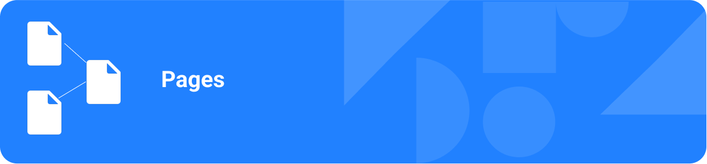

Esta seção reúne a documentação de todas as **páginas principais** do frontend do projeto **Mapa da Acessibilidade**. Aqui, você encontrará descrições detalhadas sobre o propósito, funcionamento e principais elementos de cada página do sistema, incluindo telas como Home, Cadastro, Login, Sobre, FAQ, Contato, Eventos e outras.

Utilize esta seção para se orientar sobre como cada parte do frontend foi planejada, implementada e como elas se conectam para oferecer uma experiência acessível e colaborativa para todos os usuários.

## 📝 `Cadastro`

A página `Cadastro` localizado em (`src/pages/Cadastro.jsx`) é responsável por exibir e gerenciar o formulário de criação de nova conta de usuário no frontend do projeto **Mapa da Acessibilidade**.

**Função e contexto**

Esta página oferece uma interface moderna, acessível e responsiva para que novos usuários possam se cadastrar na plataforma. Ele faz parte do fluxo de autenticação do sistema, sendo fundamental para ampliar a base de usuários e permitir a participação ativa na comunidade.

```jsx
// Arquivo: `src/pages/Cadastro.jsx`

import { useState } from 'react';
import { Link, useNavigate } from 'react-router-dom';
import { Mail, Lock, User, Eye, EyeOff, UserPlus, Facebook, Chrome, Apple } from 'lucide-react';
import { useToast } from "../hooks/use-toast";
import './Cadastro.css';

export default function Register() {
  const { toast } = useToast();
  const navigate = useNavigate();
  const [showPassword, setShowPassword] = useState(false);
  const [showConfirmPassword, setShowConfirmPassword] = useState(false);

  const handleSubmit = (e) => {
    e.preventDefault();
    const password = e.currentTarget.elements.namedItem('password').value;
    const confirmPassword = e.currentTarget.elements.namedItem('confirm-password').value;

    if (password !== confirmPassword) {
      toast({
        title: "Erro",
        description: "As senhas não coincidem!",
        variant: "destructive",
      });
      return;
    }

    toast({
      title: "Criando sua conta...",
      description: "Isso levará apenas um momento.",
    });

    setTimeout(() => {
      toast({
        title: "Conta criada com sucesso!",
        description: "Você já pode fazer login.",
      });
      navigate('/login');
    }, 1500);
  };

  return (
    <div className="register-container">
      <div className="register-card">
        <div className="register-header">
          <div className="register-icon">
            <UserPlus />
          </div>
          <h1 className="register-title">Criar nova conta</h1>
          <p className="register-subtitle">
            Já tem uma conta? <Link to="/login" className="register-link">Faça login</Link>
          </p>
        </div>
        
        <form onSubmit={handleSubmit} className="register-form">
          <div className="form-group">
            <div className="input-wrapper">
              <User className="input-icon" />
              <input
                id="name"
                name="name"
                type="text"
                placeholder="Nome Completo"
                required
                className="form-input"
              />
            </div>
          </div>

          <div className="form-group">
            <div className="input-wrapper">
              <Mail className="input-icon" />
              <input
                id="email"
                name="email"
                type="email"
                placeholder="E-mail"
                required
                className="form-input"
              />
              <div className="input-flag">                
              </div>
            </div>
          </div>

          <div className="form-group">
            <div className="input-wrapper">
              <Lock className="input-icon" />
              <input
                id="password"
                name="password"
                type={showPassword ? "text" : "password"}
                placeholder="Senha"
                required
                className="form-input"
              />
              <button
                type="button"
                className="toggle-password"
                onClick={() => setShowPassword(!showPassword)}
              >
                {showPassword ? <EyeOff /> : <Eye />}
              </button>
            </div>
          </div>

          <div className="form-group">
            <div className="input-wrapper">
              <Lock className="input-icon" />
              <input
                id="confirm-password"
                name="confirm-password"
                type={showConfirmPassword ? "text" : "password"}
                placeholder="Confirmar Senha"
                required
                className="form-input"
              />
              <button
                type="button"
                className="toggle-password"
                onClick={() => setShowConfirmPassword(!showConfirmPassword)}
              >
                {showConfirmPassword ? <EyeOff /> : <Eye />}
              </button>
            </div>
          </div>

          <div className="checkbox-group">
            <div className="checkbox-wrapper">
              <input type="checkbox" id="terms" required className="checkbox" />
              <label htmlFor="terms" className="checkbox-label">
                Eu concordo com os <a href="#" className="terms-link">Termos de Serviço</a> e <a href="#" className="terms-link">Política de Privacidade</a>
              </label>
            </div>
          </div>

          <button type="submit" className="register-button">
            <UserPlus />
            Cadastrar
          </button>
        </form>

        <div className="divider">
          <span>Ou cadastre-se com</span>
        </div>

        <div className="social-buttons">
          <button className="social-button facebook">
            <Facebook />
          </button>
          <button className="social-button google">
            <Chrome />
          </button>
          <button className="social-button apple">
            <Apple />
          </button>
        </div>
      </div>
    </div>
  );
}
```

**Principais funcionalidades**

- **Formulário de cadastro:**
  Coleta nome completo, e-mail, senha e confirmação de senha do usuário.

- **Validação de senha:** 
  Garante que a senha e a confirmação sejam iguais, exibindo mensagens de erro amigáveis caso haja divergência.

- **Exibição/ocultação de senha:**
  Permite ao usuário visualizar ou ocultar o conteúdo dos campos de senha e confirmação, melhorando a usabilidade.

- **Aceite dos termos:**  
  Exige que o usuário concorde com os Termos de Serviço e a Política de Privacidade antes de concluir o cadastro.

- **Feedback visual:**  
  Utiliza toasts para informar o usuário sobre erros, progresso e sucesso no cadastro.

- **Cadastro social:**
  Oferece opções para cadastro rápido via Facebook, Google e Apple, facilitando o acesso à plataforma.

- **Navegação:** 
  Inclui link para a página de login para usuários que já possuem conta.

**Estilização**

O componente utiliza o arquivo `Cadastro.css` para garantir:
- Layout centralizado e responsivo.
- Campos de formulário com ícones ilustrativos.
- Botões com feedback visual e acessibilidade.
- Separação clara entre cadastro tradicional e social.

**Exemplo de uso**

O componente é utilizado como uma página independente, acessível via rota `/cadastro`:

```jsx
import Cadastro from './pages/Cadastro';

<Route path="/cadastro" element={<Cadastro />} />
```

**Resumo**

O componente Cadastro é essencial para a experiência do usuário no mapa, promovendo um fluxo de cadastro simples, seguro e acessível. Sua implementação modular, validação robusta e integração com autenticação social do projeto.

---

## 📞 `Contato`

**Página de Contato**

A página `Contato` localizada em (`src/pages/Contato.jsx`) é responsável por centralizar todos os canais de comunicação entre os usuários e a equipe do projeto **Mapa da Acessibilidade**. Ela oferece informações institucionais, dados de contato e um formulário para envio direto de mensagens, promovendo transparência, suporte e engajamento com a comunidade.

**Função e contexto**

Esta página é fundamental para facilitar o diálogo com usuários, parceiros e colaboradores, permitindo o envio de dúvidas, sugestões, feedbacks e solicitações de suporte. Além disso, reforça a credibilidade do sistema ao apresentar informações institucionais claras e acessíveis.

```jsx
// Arquivo: (`src/pages/Contato.jsx`)

import React, { useState } from 'react';
import { Mail, Phone, MapPin, Send, MessageCircle, Clock } from 'lucide-react';
import './Contato.css';

export default function Contact() {
  const [formData, setFormData] = useState({
    name: '',
    email: '',
    subject: '',
    message: ''
  });

  const contactInfo = [
    {
      icon: Mail,
      title: "Email",
      description: "contato@acessibilidade.com",
      action: "mailto:contato@acessibilidade.com"
    },
    {
      icon: Phone,
      title: "Telefone",
      description: "(11) 1234-5678",
      action: "tel:+551112345678"
    },
    {
      icon: MapPin,
      title: "Endereço",
      description: "Universidade de Brasília - UnB\nCampus Darcy Ribeiro, Brasília - DF",
      action: null
    },
    {
      icon: Clock,
      title: "Horário de Atendimento",
      description: "Segunda a Sexta: 9h às 18h\nSábado: 9h às 12h",
      action: null
    }
  ];

  const handleInputChange = (e) => {
    const { name, value } = e.target;
    setFormData(prev => ({
      ...prev,
      [name]: value
    }));
  };

  const handleSubmit = (e) => {
    e.preventDefault();
    
    if (!formData.name || !formData.email || !formData.message) {
      alert('Por favor, preencha todos os campos obrigatórios.');
      return;
    }
    
    alert('Mensagem enviada com sucesso! Responderemos em breve.');
    setFormData({
      name: '',
      email: '',
      subject: '',
      message: ''
    });
  };

  return (
    <main className="contact-main">
      <section id="contato" className="contact-section">
        <div className="contact-container">
          <div className="contact-header">
            <div className="contact-title-wrapper">
              <MessageCircle className="contact-icon" />
              <h2 className="contact-title">Contato</h2>
            </div>
            <p className="contact-subtitle">
              Entre em contato conosco! Estamos aqui para ajudar e ouvir suas sugestões
            </p>
          </div>

          <div className="contact-content">
            <div className="contact-info-section">
              <h3 className="contact-info-title">
                Informações de Contato
              </h3>
              
              <div className="contact-info-grid">
                {contactInfo.map((info, index) => {
                  const IconComponent = info.icon;
                  return (
                    <div key={index} className="contact-info-card">
                      <div className="contact-info-content">
                        <div className="contact-info-icon-wrapper">
                          <IconComponent className="contact-info-icon" />
                        </div>
                        <div className="contact-info-text">
                          <h4 className="contact-info-card-title">
                            {info.title}
                          </h4>
                          {info.action ? (
                            <a 
                              href={info.action}
                              className="contact-info-link"
                            >
                              {info.description}
                            </a>
                          ) : (
                            <p className="contact-info-description">
                              {info.description}
                            </p>
                          )}
                        </div>
                      </div>
                    </div>
                  );
                })}
              </div>
            </div>

            <div className="contact-form-section">
              <div className="contact-form-card">
                <div className="contact-form-header">
                  <h3 className="contact-form-title">
                    Envie sua Mensagem
                  </h3>
                  <p className="contact-form-description">
                    Preencha o formulário abaixo e entraremos em contato o mais breve possível.
                  </p>
                </div>
                <div className="contact-form-content">
                  <form onSubmit={handleSubmit} className="contact-form">
                    <div className="form-row">
                      <div className="form-group">
                        <label htmlFor="name" className="form-label">
                          Nome *
                        </label>
                        <input
                          type="text"
                          id="name"
                          name="name"
                          value={formData.name}
                          onChange={handleInputChange}
                          placeholder="Seu nome completo"
                          required
                          className="form-input"
                        />
                      </div>
                      <div className="form-group">
                        <label htmlFor="email" className="form-label">
                          Email *
                        </label>
                        <input
                          type="email"
                          id="email"
                          name="email"
                          value={formData.email}
                          onChange={handleInputChange}
                          placeholder="seu@email.com"
                          required
                          className="form-input"
                        />
                      </div>
                    </div>

                    <div className="form-group">
                      <label htmlFor="subject" className="form-label">
                        Assunto
                      </label>
                      <input
                        type="text"
                        id="subject"
                        name="subject"
                        value={formData.subject}
                        onChange={handleInputChange}
                        placeholder="Sobre o que você gostaria de falar?"
                        className="form-input"
                      />
                    </div>

                    <div className="form-group">
                      <label htmlFor="message" className="form-label">
                        Mensagem *
                      </label>
                      <textarea
                        id="message"
                        name="message"
                        value={formData.message}
                        onChange={handleInputChange}
                        placeholder="Descreva sua dúvida, sugestão ou feedback..."
                        rows={6}
                        required
                        className="form-textarea"
                      />
                    </div>

                    <button 
                      type="submit"
                      className="form-submit-button"
                    >
                      <Send className="submit-icon" />
                      Enviar Mensagem
                    </button>
                  </form>
                </div>
              </div>
            </div>
          </div>
        </div>
      </section>
    </main>
  );
}
```

**Principais funcionalidades**

- **Exibição de informações de contato:**  
  Mostra e-mail, telefone, endereço institucional e horários de atendimento, cada um acompanhado de ícones ilustrativos para facilitar a identificação visual.
- **Links interativos:**  
  E-mail e telefone são clicáveis, permitindo que o usuário inicie rapidamente uma mensagem ou ligação.
- **Formulário de contato:**  
  Permite que o usuário envie uma mensagem diretamente pela plataforma, preenchendo nome, e-mail, assunto e mensagem.
- **Validação de campos obrigatórios:**  
  O formulário exige o preenchimento de nome, e-mail e mensagem, exibindo alertas caso algum campo obrigatório não seja preenchido.
- **Feedback ao usuário:**  
  Após o envio, o usuário recebe uma confirmação de que a mensagem foi enviada com sucesso.
- **Estilização dedicada:**  
  Utiliza o arquivo `Contato.css` para garantir layout responsivo, visual moderno e acessível.

**Estrutura do componente**

- **Seção de informações institucionais:**  
  Apresenta os principais canais de contato do projeto, com ícones e links.
- **Formulário de mensagem:**  
  Estruturado em campos de nome, e-mail, assunto e mensagem, com botão de envio destacado.
- **Responsividade:**  
  O layout se adapta a diferentes tamanhos de tela, garantindo boa experiência tanto em desktop quanto em dispositivos móveis.

**Exemplo de uso**

A página é acessível via rota `/contato` e pode ser utilizada em conjunto com outros componentes de navegação do sistema:

```jsx
import Contato from './pages/Contato';

<Route path="/contato" element={<Contato />} />
```

---

## 🏢 `Eventos`

**Página de Eventos**

A página `Eventos` localizada na pasta (`src/pages/Eventos.jsx`) é responsável por apresentar e promover os principais eventos relacionados à acessibilidade e à comunidade do **Mapa da Acessibilidade**. Ela conecta usuários a oportunidades de aprendizado, colaboração e engajamento, fortalecendo a rede de participantes do projeto.

**Função e contexto** 

Esta página centraliza a divulgação de workshops, webinars, mutirões, hackathons e outras ações comunitárias, incentivando a participação ativa dos usuários e a troca de experiências. Além de listar eventos futuros, a página oferece recursos para inscrição, visualização de detalhes e até mesmo para propor novos eventos, tornando-se um ponto de encontro dinâmico para a comunidade.

```jsx
// Arquivo: (`src/pages/Eventos.jsx`)
import { Calendar, MapPin, Users, Clock, ExternalLink } from 'lucide-react';
import React from 'react';
import './Eventos.css';

export default function Events() {
  console.log("Events component rendered");

  const upcomingEvents = [
    {
      id: 1,
      title: "Workshop: Avaliação de Acessibilidade Urbana",
      description: "Aprenda a avaliar e cadastrar locais acessíveis de forma técnica e precisa. Workshop prático com especialistas.",
      date: "2025-06-20",
      time: "14:00",
      location: "Centro Cultural Banco do Brasil - RJ",
      type: "workshop",
      attendees: 45,
      maxAttendees: 60,
      isOnline: false,
      isFree: true
    },
    {
      id: 2,
      title: "Webinar: Tecnologias Assistivas e Mapping",
      description: "Como as tecnologias assistivas podem ser integradas ao mapeamento colaborativo de acessibilidade.",
      date: "2025-06-25",
      time: "19:00",
      location: "Online",
      type: "webinar",
      attendees: 128,
      maxAttendees: 200,
      isOnline: true,
      isFree: true
    },
    {
      id: 3,
      title: "Mutirão de Mapeamento - Zona Sul",
      description: "Ação comunitária para mapear locais acessíveis na Zona Sul do Rio. Participação aberta a todos!",
      date: "2025-07-02",
      time: "09:00",
      location: "Copacabana - Ponto de encontro na Praia",
      type: "acao",
      attendees: 23,
      maxAttendees: 50,
      isOnline: false,
      isFree: true
    },
    {
      id: 4,
      title: "Hackathon: Soluções de Acessibilidade",
      description: "48h desenvolvendo soluções inovadoras para problemas de acessibilidade urbana. Prêmios para os melhores projetos!",
      date: "2025-07-15",
      time: "18:00",
      location: "Campus Universitário - UnB",
      type: "hackathon",
      attendees: 67,
      maxAttendees: 100,
      isOnline: false,
      isFree: false
    }
  ];

  const eventTypes = {
    workshop: { label: "Workshop", color: "event-badge-workshop" },
    webinar: { label: "Webinar", color: "event-badge-webinar" },
    acao: { label: "Ação Comunitária", color: "event-badge-acao" },
    hackathon: { label: "Hackathon", color: "event-badge-hackathon" }
  };

  const formatDate = (dateString) => {
    const date = new Date(dateString);
    return date.toLocaleDateString('pt-BR', { 
      weekday: 'long', 
      year: 'numeric', 
      month: 'long', 
      day: 'numeric' 
    });
  };

  const handleEventClick = (eventId) => {
    console.log("Event clicked", { eventId });
  };

  const handleRegister = (eventId) => {
    console.log("Register for event clicked", { eventId });
  };

  return (
    <section id="eventos" className="events-section">
      <div className="events-container">
        {/* Section Header */}
        <div className="events-header">
          <div className="events-title-wrapper">
            <Calendar className="events-title-icon" />
            <h2 className="events-title">
              Eventos
            </h2>
          </div>
          <p className="events-subtitle">
            Participe de workshops, mutirões e ações que fortalecem nossa comunidade
          </p>
        </div>

        {/* Events Grid */}
        <div className="events-grid">
          {upcomingEvents.map((event) => (
            <div 
              key={event.id}
              className="event-card"
              onClick={() => handleEventClick(event.id)}
            >
              <div className="event-card-header">
                <div className="event-badges-row">
                  <span className={`event-badge ${eventTypes[event.type].color}`}>
                    {eventTypes[event.type].label}
                  </span>
                  <div className="event-status-badges">
                    {event.isFree && (
                      <span className="event-badge event-badge-free">
                        Gratuito
                      </span>
                    )}
                    {event.isOnline && (
                      <span className="event-badge event-badge-online">
                        Online
                      </span>
                    )}
                  </div>
                </div>
                <h3 className="event-card-title">
                  {event.title}
                </h3>
              </div>
              
              <div className="event-card-content">
                <p className="event-description">
                  {event.description}
                </p>
                
                <div className="event-details">
                  <div className="event-detail-item">
                    <Calendar className="event-detail-icon" />
                    {formatDate(event.date)}
                  </div>
                  
                  <div className="event-detail-item">
                    <Clock className="event-detail-icon" />
                    {event.time}
                  </div>
                  
                  <div className="event-detail-item">
                    <MapPin className="event-detail-icon" />
                    {event.location}
                  </div>
                  
                  <div className="event-detail-item">
                    <Users className="event-detail-icon" />
                    {event.attendees}/{event.maxAttendees} participantes
                  </div>
                </div>

                <div className="event-actions">
                  <button 
                    className="event-btn event-btn-primary"
                    onClick={(e) => {
                      e.stopPropagation();
                      handleRegister(event.id);
                    }}
                  >
                    Inscrever-se
                  </button>
                  <button 
                    className="event-btn event-btn-secondary"
                    onClick={(e) => {
                      e.stopPropagation();
                      console.log("View details clicked", event.id);
                    }}
                  >
                    <ExternalLink className="event-btn-icon" />
                    Detalhes
                  </button>
                </div>
                
                {/* Progress bar for attendees */}
                <div className="event-progress-wrapper">
                  <div className="event-progress-bar">
                    <div 
                      className="event-progress-fill" 
                      style={{ 
                        width: `${(event.attendees / event.maxAttendees) * 100}%` 
                      }}
                    ></div>
                  </div>
                  <p className="event-progress-text">
                    {Math.round((event.attendees / event.maxAttendees) * 100)}% das vagas preenchidas
                  </p>
                </div>
              </div>
            </div>
          ))}
        </div>

        {/* Call to Action */}
        <div className="events-cta-wrapper">
          <div className="events-cta">
            <h3 className="events-cta-title">
              Organize seu Próprio Evento!
            </h3>
            <p className="events-cta-description">
              Tem uma ideia para um workshop, mutirão ou ação comunitária? 
              Ajudamos você a organizar e divulgar seu evento relacionado à acessibilidade.
            </p>
            <div className="events-cta-buttons">
              <button 
                className="events-cta-btn"
                onClick={() => console.log("Propose event clicked")}
              >
                Propor Evento
              </button>
              <button 
                className="events-cta-btn"
                onClick={() => console.log("Event guide clicked")}
              >
                Guia do Organizador
              </button>
            </div>
          </div>
        </div>
      </div>
    </section>
  );
}
```

**Principais funcionalidades** 

- **Listagem de eventos futuros:**  
  Exibe cards para cada evento, contendo título, descrição, data, horário, local, tipo (workshop, webinar, ação comunitária, hackathon), número de participantes e status (gratuito, online).
- **Badges e destaques:**  
  Cada evento possui badges coloridas indicando o tipo, se é gratuito e/ou online, facilitando a identificação visual.
- **Barra de progresso:**  
  Mostra o percentual de vagas preenchidas para cada evento, promovendo senso de urgência e engajamento.
- **Ações rápidas:**  
  Permite ao usuário se inscrever no evento ou visualizar mais detalhes, com botões destacados e feedback visual.
- **Chamada para ação:**  
  Ao final da página, há um convite para que qualquer usuário proponha um novo evento ou acesse o guia do organizador, incentivando a colaboração e a iniciativa da comunidade.
- **Estilização dedicada:**  
  Utiliza o arquivo `Eventos.css` para garantir layout responsivo, visual moderno e acessível.

**Estrutura do componente**

- **Cabeçalho da seção:**  
  Ícone de calendário, título "Eventos" e subtítulo motivacional.
- **Grid de eventos:**  
  Cards organizados em grid, cada um com informações detalhadas, badges, barra de progresso e botões de ação.
- **Chamada para ação (CTA):**  
  Seção destacada para incentivar a organização de novos eventos, com botões para propor evento e acessar o guia do organizador.

**Exemplo de uso** 

A página é acessível via rota `/eventos` e pode ser utilizada em conjunto com outros componentes de navegação do sistema:

```jsx
import Eventos from './pages/Eventos';

<Route path="/eventos" element={<Eventos />} />
```

**Resumo**

A página Eventos é fundamental para o engajamento e o crescimento da comunidade, promovendo a participação em ações educativas, colaborativas e inovadoras.

---

## ❓ `FAQ`

A página **FAQ** (Frequently Asked Questions) localizada na pasta (`src/pages/FAQ.jsx`) centraliza as principais dúvidas dos usuários sobre o funcionamento e os recursos do **Mapa da Acessibilidade**. Ela foi desenvolvida para oferecer suporte rápido, transparente e acessível, reduzindo barreiras de uso e promovendo autonomia para novos e antigos usuários da plataforma.

**Função e contexto**

Esta página é fundamental para a experiência do usuário, pois antecipa respostas para questões recorrentes sobre cadastro, avaliação de locais, tipos de acessibilidade mapeados, uso do aplicativo, contribuição com o projeto, veracidade das informações, uso offline e canais de contato para sugestões ou problemas.

```jsx
import React, { useState } from 'react';
import { HelpCircle } from 'lucide-react';
import { Link } from 'react-router-dom';
import './FAQ.css';

const faqItems = [
  {
    id: 1,
    question: "Como posso adicionar um novo local no mapa?",
    answer: "Para adicionar um novo local, você precisa estar logado na plataforma. Clique no botão 'Adicionar Local' no mapa ou no menu superior, preencha as informações do local incluindo tipos de acessibilidade disponíveis, e nossa equipe verificará as informações antes da publicação."
  },
  {
    id: 2,
    question: "Como funciona o sistema de avaliações?",
    answer: "Qualquer usuário cadastrado pode avaliar locais já mapeados. O sistema considera a experiência real de acessibilidade do local, permitindo comentários sobre rampas, banheiros adaptados, piso tátil e outros recursos. As avaliações ajudam a comunidade a ter informações mais precisas."
  },
  {
    id: 3,
    question: "Quais tipos de acessibilidade são mapeados?",
    answer: "Mapeamos diversos tipos de acessibilidade: rampas de acesso para cadeirantes, piso tátil para deficientes visuais, banheiros adaptados, elevadores acessíveis, vagas de estacionamento para PCD, sinalização em braile, intérpretes de libras, e outros recursos que facilitam a mobilidade."
  },
  {
    id: 4,
    question: "O aplicativo é gratuito?",
    answer: "Sim! O Mapa da Acessibilidade é completamente gratuito para todos os usuários. Nosso objetivo é tornar informações sobre acessibilidade acessíveis a todos, sem barreiras financeiras."
  },
  {
    id: 5,
    question: "Como posso contribuir com o projeto?",
    answer: "Existem várias formas de contribuir: cadastrando novos locais, avaliando locais existentes, reportando informações incorretas, compartilhando o app com amigos, ou contribuindo com código no GitHub (somos open source!). Toda ajuda é bem-vinda!"
  },
  {
    id: 6,
    question: "Como garantem a veracidade das informações?",
    answer: "Temos um processo de moderação onde nossa equipe verifica informações antes da publicação. Além disso, a própria comunidade ajuda reportando informações incorretas. Priorizamos sempre informações verificadas e atualizadas."
  },
  {
    id: 7,
    question: "Posso usar o app offline?",
    answer: "Algumas funcionalidades básicas estarão disponíveis offline em breve, como visualizar locais já salvos. No entanto, para buscar novos locais e enviar avaliações, você precisará de conexão com a internet."
  },
  {
    id: 8,
    question: "Como reportar um problema ou sugerir melhorias?",
    answer: "Entre em contato conosco pelo email contato@acessibilidade.com, pelas redes sociais, ou abra uma issue no nosso repositório GitHub. Valorizamos muito o feedback da comunidade para melhorar continuamente a plataforma."
  }
];

const FAQ = () => {
  const [activeItem, setActiveItem] = useState(null);

  const toggleItem = (id) => {
    setActiveItem(activeItem === id ? null : id);
  };

  return (
    <main>
      <section id="faq" className="faq-section">
        <div className="faq-container">
          {/* Section Header */}
          <div className="faq-header">
            <div className="faq-title-wrapper">
              <HelpCircle className="faq-icon" />
              <h2 className="faq-title">
                FAQ - Perguntas Frequentes
              </h2>
            </div>
            <p className="faq-subtitle">
              Tire suas dúvidas sobre como usar o Mapa da Acessibilidade
            </p>
          </div>

          {/* FAQ Items */}
          <div className="faq-accordion">
            {faqItems.map((item) => (
              <div 
                key={item.id} 
                className={`faq-item ${activeItem === item.id ? 'active' : ''}`}
              >
                <button
                  className="faq-question"
                  onClick={() => toggleItem(item.id)}
                  aria-expanded={activeItem === item.id}
                >
                  <h3 className="faq-question-text">
                    {item.question}
                  </h3>
                  <div className="faq-chevron">
                    <svg
                      width="20"
                      height="20"
                      viewBox="0 0 24 24"
                      fill="none"
                      stroke="currentColor"
                      strokeWidth="2"
                      strokeLinecap="round"
                      strokeLinejoin="round"
                    >
                      <polyline points="6,9 12,15 18,9" />
                    </svg>
                  </div>
                </button>
                <div className={`faq-answer ${activeItem === item.id ? 'expanded' : ''}`}>
                  <div className="faq-answer-content">
                    <p>{item.answer}</p>
                  </div>
                </div>
              </div>
            ))}
          </div>

          {/* Contact CTA */}
          <div className="faq-cta">
            <div className="faq-cta-content">
              <h3 className="faq-cta-title">
                Não encontrou sua resposta?
              </h3>
              <p className="faq-cta-text">
                Nossa equipe está aqui para ajudar! Entre em contato conosco.
              </p>
              <div className="faq-cta-buttons">
                <Link to="/contato" className="faq-button faq-button-outline">
                  Entrar em Contato
                </Link>
              </div>
            </div>
          </div>
        </div>
      </section>
    </main>
  );
};

export default FAQ;
```

**Principais funcionalidades**

- **Lista de perguntas e respostas:**  
  As perguntas frequentes são apresentadas em um formato de acordeão (accordion), permitindo ao usuário expandir e recolher cada item para visualizar a resposta correspondente.
- **Acessibilidade:**  
  O componente utiliza botões acessíveis, com feedback visual e atributos ARIA, garantindo navegação por teclado e leitores de tela.
- **Design amigável:**  
  Ícones ilustrativos, títulos claros e layout responsivo tornam a navegação intuitiva em qualquer dispositivo.
- **Chamada para contato:**  
  Caso o usuário não encontre sua dúvida, há uma seção destacada com botão para a página de contato, incentivando o diálogo direto com a equipe.
- **Estilização dedicada:**  
  Utiliza o arquivo `FAQ.css` para garantir visual moderno, espaçamento adequado e contraste acessível.

**Estrutura do componente**

- **Cabeçalho da seção:**  
  Ícone de ajuda, título "FAQ - Perguntas Frequentes" e subtítulo orientando o usuário.
- **Acordeão de perguntas:**  
  Cada pergunta pode ser expandida individualmente para exibir a resposta, melhorando a organização e a experiência de leitura.
- **Chamada para ação (CTA):**  
  Seção ao final da página convidando o usuário a entrar em contato caso não encontre a resposta desejada.

**Exemplo de uso**

A página é acessível via rota `/faq` e pode ser utilizada em conjunto com outros componentes de navegação do sistema:

```jsx
import FAQ from './pages/FAQ';

<Route path="/faq" element={<FAQ />} />
```

**Resumo**

A página FAQ é essencial para o suporte e a autonomia dos usuários do Mapa da Acessibilidade, promovendo esclarecimento de dúvidas, incentivo à participação e fortalecimento da relação entre a equipe do projeto e a comunidade.

---

## 🏠 `Home`

A página **Home** localizada em (`src/pages/Home.jsx`) é o ponto de entrada do usuário no frontend do projeto **Mapa da Acessibilidade**. Ela oferece uma experiência interativa de navegação e busca por locais acessíveis, integrando funcionalidades de mapa, filtros avançados, visualização detalhada de locais e avaliações da comunidade.

**Função e contexto**

A Home foi projetada para ser o centro de consulta e exploração de locais acessíveis, permitindo que qualquer usuário visualize rapidamente pontos de interesse, filtre por recursos de acessibilidade, acesse informações detalhadas e contribua com avaliações. É uma peça fundamental para promover a mobilidade, inclusão e colaboração entre os usuários do sistema.

```jsx
import { MapContainer, TileLayer, Marker } from "react-leaflet";
import "leaflet/dist/leaflet.css";
import { Icon } from "leaflet";
import { useState, useEffect } from "react";
import {
  X,
  Star,
  Clock,
  Phone,
  ArrowRight,
  Edit,
  Accessibility,
  WashingMachine,
  Eye,
  Building,
  MapPin,
  Menu,
  Search,
  SlidersHorizontal,
  Users,
  Volume2,
} from "lucide-react";
import "./Home.css";

// Configurações dos marcadores
const markers = [
  {
    id: 1,
    geocode: [-15.7942, -47.8822],
    name: "Shopping Brasília",
    description: "Shopping Center",
    popUp:
      "Shopping com excelente acessibilidade, contando com rampas em todas as entradas, banheiros adaptados em todos os pisos, piso tátil em áreas comuns e elevadores com sinalização em braile.",
    image:
      "https://images.unsplash.com/photo-1555529669-e69e7aa0ba9a?ixlib=rb-1.2.1&auto=format&fit=crop&w=500&q=80",
    rating: 4.5,
    reviews: 23,
    accessibility: 9,
    address: "SHTN Trecho 1, Conjunto 1B - Asa Norte",
    city: "Brasília - DF",
    hours: {
      weekdays: "10h às 22h",
      weekend: "11h às 21h",
    },
    contact: {
      phone: "(61) 1234-5678",
      email: "contato@shoppingbrasilia.com.br",
    },
    features: ["ramp", "bathroom", "tactile", "elevator"],
    photos: [
      "https://images.unsplash.com/photo-1555529669-e69e7aa0ba9a?ixlib=rb-1.2.1&auto=format&fit=crop&w=500&q=80",
      "https://images.unsplash.com/photo-1581092921461-39b2f2a85979?ixlib=rb-1.2.1&auto=format&fit=crop&w=500&q=80",
      "https://images.unsplash.com/photo-1559839732-f8a0a1d2d8b3?ixlib=rb-1.2.1&auto=format&fit=crop&w=500&q=80",
    ],
  },
  {
    id: 2,
    geocode: [-15.7801, -47.9292],
    name: "Centro Cultural Banco do Brasil",
    description: "Centro Cultural",
    popUp:
      "Centro cultural totalmente acessível com entrada principal adaptada, elevadores, banheiros especiais e programação cultural inclusiva.",
    image:
      "https://images.unsplash.com/photo-1518021833641-d8e8d8e9f6bb?ixlib=rb-1.2.1&auto=format&fit=crop&w=500&q=80",
    rating: 4.2,
    reviews: 18,
    accessibility: 8,
    address: "SCES Trecho 2, Lote 22",
    city: "Brasília - DF",
    hours: {
      weekdays: "9h às 21h",
      weekend: "9h às 21h",
    },
    contact: {
      phone: "(61) 3108-7600",
      email: "ccbb.brasilia@bb.com.br",
    },
    features: ["ramp", "bathroom", "elevator"],
    photos: [
      "https://images.unsplash.com/photo-1518021833641-d8e8d8e9f6bb?ixlib=rb-1.2.1&auto=format&fit=crop&w=500&q=80",
      "https://images.unsplash.com/photo-1571019613454-1cb2f99b2d8b?ixlib=rb-1.2.1&auto=format&fit=crop&w=500&q=80",
      "https://images.unsplash.com/photo-1460661419201-fd4cecdf8a8b?ixlib=rb-1.2.1&auto=format&fit=crop&w=500&q=80",
    ],
  },
];

// Ícone customizado (usando um ícone padrão do Leaflet)
const iconeCustom = new Icon({
  iconUrl: "https://unpkg.com/leaflet@1.7.1/dist/images/marker-icon.png",
  shadowUrl: "https://unpkg.com/leaflet@1.7.1/dist/images/marker-shadow.png",
  iconSize: [25, 41],
  iconAnchor: [12, 41],
  popupAnchor: [1, -34],
  shadowSize: [41, 41]
});

function Home() {
  const [filtersOpen, setFiltersOpen] = useState(true);
  const [drawerOpen, setDrawerOpen] = useState(false);
  const [selectedMarker, setSelectedMarker] = useState(null);
  const [isMobile, setIsMobile] = useState(false);
  const [searchQuery, setSearchQuery] = useState("");

  useEffect(() => {
    const checkMobile = () => {
      setIsMobile(window.innerWidth < 768);
      if (window.innerWidth >= 768) {
        setFiltersOpen(true);
      }
    };

    checkMobile();
    window.addEventListener("resize", checkMobile);
    return () => window.removeEventListener("resize", checkMobile);
  }, []);

  const handleMarkerClick = (marker) => {
    setSelectedMarker(marker);
    setDrawerOpen(true);
    if (isMobile) {
      setFiltersOpen(false);
    }
  };

  const closeDrawer = () => {
    setDrawerOpen(false);
  };

  const toggleFilters = () => {
    setFiltersOpen(!filtersOpen);
  };

  const getFeatureIcon = (feature) => {
    switch (feature) {
      case "ramp":
        return <Accessibility className="feature-icon" />;
      case "bathroom":
        return <WashingMachine className="feature-icon" />;
      case "tactile":
        return <Eye className="feature-icon" />;
      case "elevator":
        return <Building className="feature-icon" />;
      case "wheelchair":
        return <Accessibility className="feature-icon" />;
      case "audio":
        return <Volume2 className="feature-icon" />;
      case "braille":
        return <Eye className="feature-icon" />;
      default:
        return null;
    }
  };

  const getFeatureClass = (feature) => {
    switch (feature) {
      case "ramp":
        return "feature-tag feature-ramp";
      case "bathroom":
        return "feature-tag feature-bathroom";
      case "tactile":
        return "feature-tag feature-tactile";
      case "elevator":
        return "feature-tag feature-elevator";
      case "wheelchair":
        return "feature-tag feature-wheelchair";
      case "audio":
        return "feature-tag feature-audio";
      case "braille":
        return "feature-tag feature-braille";
      default:
        return "feature-tag feature-default";
    }
  };

  const getFeatureLabel = (feature) => {
    switch (feature) {
      case "ramp":
        return "Rampas";
      case "bathroom":
        return "Banheiros";
      case "tactile":
        return "Pisos táteis";
      case "elevator":
        return "Elevadores";
      case "wheelchair":
        return "Acesso Cadeirante";
      case "audio":
        return "Sinalização Sonora";
      case "braille":
        return "Braile";
      default:
        return feature;
    }
  };

  function FiltersSidebar() {
    return (
      <aside className={`filters-sidebar ${filtersOpen ? 'filters-open' : 'filters-closed'}`}>
        <div className="filters-header">
          <h2 className="filters-title">Filtrar Locais</h2>
          <button
            onClick={toggleFilters}
            className="filters-toggle"
          >
            <Menu size={24} />
          </button>
        </div>

        <div className="filters-content">
          <div className="filter-section">
            <h3 className="filter-section-title">
              <Accessibility size={20} />
              Filtros de Acessibilidade
            </h3>
            
            <div className="filter-item">
              <input
                type="checkbox"
                id="filter-ramp"
                className="filter-checkbox"
                defaultChecked
              />
              <label htmlFor="filter-ramp" className="filter-label">
                <Accessibility className="filter-icon filter-icon-blue" />
                Rampa de Acesso
              </label>
            </div>

            <div className="filter-item">
              <input
                type="checkbox"
                id="filter-tactile"
                className="filter-checkbox"
                defaultChecked
              />
              <label htmlFor="filter-tactile" className="filter-label">
                <Eye className="filter-icon filter-icon-purple" />
                Piso Tátil
              </label>
            </div>

            <div className="filter-item">
              <input
                type="checkbox"
                id="filter-bathroom"
                className="filter-checkbox"
                defaultChecked
              />
              <label htmlFor="filter-bathroom" className="filter-label">
                <WashingMachine className="filter-icon filter-icon-green" />
                Banheiro Adaptado
              </label>
            </div>

            <div className="filter-item">
              <input
                type="checkbox"
                id="filter-elevator"
                className="filter-checkbox"
                defaultChecked
              />
              <label htmlFor="filter-elevator" className="filter-label">
                <Building className="filter-icon filter-icon-blue" />
                Elevador
              </label>
            </div>

            <div className="filter-item">
              <input
                type="checkbox"
                id="filter-audio"
                className="filter-checkbox"
                defaultChecked
              />
              <label htmlFor="filter-audio" className="filter-label">
                <Volume2 className="filter-icon filter-icon-yellow" />
                Sinalização Sonora
              </label>
            </div>

            <div className="filter-item">
              <input
                type="checkbox"
                id="filter-braille"
                className="filter-checkbox"
                defaultChecked
              />
              <label htmlFor="filter-braille" className="filter-label">
                <Eye className="filter-icon filter-icon-orange" />
                Braile
              </label>
            </div>

            <div className="filter-item">
              <input
                type="checkbox"
                id="filter-wheelchair"
                className="filter-checkbox"
                defaultChecked
              />
              <label htmlFor="filter-wheelchair" className="filter-label">
                <Accessibility className="filter-icon filter-icon-blue" />
                Acesso Cadeirante
              </label>
            </div>

            <div className="filter-item">
              <input
                type="checkbox"
                id="filter-parking"
                className="filter-checkbox"
                defaultChecked
              />
              <label htmlFor="filter-parking" className="filter-label">
                <MapPin className="filter-icon filter-icon-green" />
                Estacionamento Acessível
              </label>
            </div>

            <div className="filter-item">
              <input
                type="checkbox"
                id="filter-guide"
                className="filter-checkbox"
                defaultChecked
              />
              <label htmlFor="filter-guide" className="filter-label">
                <Users className="filter-icon filter-icon-purple" />
                Guia/Intérprete
              </label>
            </div>
          </div>

          <div className="distance-section">
            <div className="distance-container">
              <span className="distance-label">Distância</span>
              <div className="distance-slider-container">
                <input
                  type="range"
                  min="1"
                  max="10"
                  defaultValue="5"
                  className="distance-slider"
                />
              </div>
              <div className="distance-markers">
                <span>1 km</span>
                <span>5 km</span>
                <span>10 km</span>
              </div>
            </div>
          </div>

          <div className="rating-section">
            <div className="rating-container">
              <span className="rating-label">Avaliação</span>
              <div className="rating-options">
                <div className="rating-item">
                  <input
                    type="radio"
                    id="rating-all"
                    name="rating"
                    value="all"
                    className="rating-radio"
                    defaultChecked
                  />
                  <label htmlFor="rating-all" className="rating-option-label">
                    Todas avaliações
                  </label>
                </div>
                <div className="rating-item">
                  <input
                    type="radio"
                    id="rating-4"
                    name="rating"
                    value="4"
                    className="rating-radio"
                  />
                  <label htmlFor="rating-4" className="rating-option-label">
                    <div className="stars-container">
                      <Star className="star star-filled" />
                      <Star className="star star-filled" />
                      <Star className="star star-filled" />
                      <Star className="star star-filled" />
                      <Star className="star star-empty" />
                    </div>
                    <span>Acima de 4</span>
                  </label>
                </div>
                <div className="rating-item">
                  <input
                    type="radio"
                    id="rating-3"
                    name="rating"
                    value="3"
                    className="rating-radio"
                  />
                  <label htmlFor="rating-3" className="rating-option-label">
                    <div className="stars-container">
                      <Star className="star star-filled" />
                      <Star className="star star-filled" />
                      <Star className="star star-filled" />
                      <Star className="star star-empty" />
                      <Star className="star star-empty" />
                    </div>
                    <span>Acima de 3</span>
                  </label>
                </div>
              </div>
            </div>
          </div>

          <div className="apply-filters-section">
            <button className="apply-filters-btn">
              <ArrowRight className="btn-icon" /> Aplicar Filtros
            </button>
          </div>
        </div>
      </aside>
    );
  }

  return (
    <div className="home-container">
      <div className="main-content">
        <FiltersSidebar />

        <div className={`map-container ${filtersOpen && !isMobile ? 'map-with-sidebar' : ''}`}>
          <div className="search-container">
            <div className="search-bar">
              <Search className="search-icon" size={20} />
              <input
                type="text"
                placeholder="Buscar locais acessíveis..."
                value={searchQuery}
                onChange={(e) => setSearchQuery(e.target.value)}
                className="search-input"
              />
              <button className="search-filters-btn">
                <SlidersHorizontal size={20} />
              </button>
            </div>
          </div>

          <MapContainer
            center={[-15.7942, -47.8822]}
            zoom={13}
            className="leaflet-map"
          >
            <TileLayer
              attribution="Tiles &copy; Esri &mdash; Source: Esri, DeLorme, NAVTEQ, USGS, Intermap, iPC, NRCAN, Esri Japan, METI, Esri China (Hong Kong), Esri (Thailand), TomTom, 2012"
              url="https://server.arcgisonline.com/ArcGIS/rest/services/World_Street_Map/MapServer/tile/{z}/{y}/{x}"
            />
            {markers.map((marker) => (
              <Marker
                key={marker.id}
                position={marker.geocode}
                icon={iconeCustom}
                eventHandlers={{
                  click: () => handleMarkerClick(marker),
                }}
              />
            ))}
          </MapContainer>
        </div>

        {selectedMarker && (
          <div className={`info-drawer ${drawerOpen ? 'drawer-open' : 'drawer-closed'}`}>
            <div className="drawer-content">
              <div className="drawer-header">
                <h3 className="drawer-title">{selectedMarker.name}</h3>
                <button
                  onClick={closeDrawer}
                  className="drawer-close-btn"
                >
                  <X size={28} />
                </button>
              </div>

              <div className="rating-display">
                <div className="stars-rating">
                  <div className="stars-background">
                    <Star className="star" />
                    <Star className="star" />
                    <Star className="star" />
                    <Star className="star" />
                    <Star className="star" />
                  </div>
                  <div
                    className="stars-foreground"
                    style={{ width: `${(selectedMarker.rating / 5) * 100}%` }}
                  >
                    <Star className="star" />
                    <Star className="star" />
                    <Star className="star" />
                    <Star className="star" />
                    <Star className="star" />
                  </div>
                </div>
                <span className="rating-text">
                  {selectedMarker.rating} ({selectedMarker.reviews} avaliações)
                </span>
              </div>

              <div className="accessibility-score">
                <div className="accessibility-header">
                  <span>Acessibilidade</span>
                  <span className="score">{selectedMarker.accessibility}/10</span>
                </div>
                <div className="accessibility-bar">
                  <div
                    className="accessibility-fill"
                    style={{ width: `${selectedMarker.accessibility * 10}%` }}
                  ></div>
                </div>
              </div>

              <div className="features-list">
                {selectedMarker.features.map((feature, index) => (
                  <span key={index} className={getFeatureClass(feature)}>
                    {getFeatureIcon(feature)}
                    {getFeatureLabel(feature)}
                  </span>
                ))}
              </div>

              <div className="info-sections">
                <div className="info-item">
                  <div className="info-icon info-icon-blue">
                    <MapPin size={24} />
                  </div>
                  <div className="info-text">
                    <p className="info-title">{selectedMarker.address}</p>
                    <p className="info-subtitle">{selectedMarker.city}</p>
                  </div>
                </div>

                <div className="info-item">
                  <div className="info-icon info-icon-green">
                    <Clock size={24} />
                  </div>
                  <div className="info-text">
                    <p className="info-title">Horário de Funcionamento</p>
                    <p className="info-subtitle">
                      Segunda a Sábado: {selectedMarker.hours.weekdays}
                    </p>
                    <p className="info-subtitle">
                      Domingo: {selectedMarker.hours.weekend}
                    </p>
                  </div>
                </div>

                <div className="info-item">
                  <div className="info-icon info-icon-purple">
                    <Phone size={24} />
                  </div>
                  <div className="info-text">
                    <p className="info-title">Contato</p>
                    <p className="info-subtitle">{selectedMarker.contact.phone}</p>
                    <p className="info-subtitle">{selectedMarker.contact.email}</p>
                  </div>
                </div>
              </div>

              <div className="description-section">
                <h4 className="section-title">Descrição</h4>
                <p className="description-text">{selectedMarker.popUp}</p>
              </div>

              <div className="photos-section">
                <h4 className="section-title">Fotos</h4>
                <div className="photos-grid">
                  {selectedMarker.photos.map((photo, index) => (
                    <div key={index} className="photo-item">
                      
                    </div>
                  ))}
                </div>
              </div>

              <div className="action-buttons">
                <button className="action-btn action-btn-primary">
                  <ArrowRight className="btn-icon" /> Rotas
                </button>
                <button className="action-btn action-btn-secondary">
                  <Edit className="btn-icon" /> Avaliar
                </button>
              </div>
            </div>
          </div>
        )}
      </div>
    </div>
  );
}

export default Home;
```

**Principais funcionalidades**

- **Mapa interativo:**  
  Utiliza o `react-leaflet` para exibir um mapa centralizado na cidade de Brasília, com marcadores personalizados representando locais acessíveis cadastrados na plataforma.

- **Marcadores detalhados:**  
  Cada marcador contém informações completas sobre o local, incluindo nome, endereço, descrição, fotos, recursos de acessibilidade, avaliações, horários de funcionamento e contatos.

- **Drawer de informações:**  
  Ao clicar em um marcador, um painel lateral (drawer) é aberto com todos os detalhes do local, avaliações, barra de acessibilidade, fotos e botões de ação para rotas e avaliação.

- **Barra lateral de filtros:**  
  Permite ao usuário filtrar locais por tipo de acessibilidade (rampa, banheiro adaptado, piso tátil, elevador, braile, sinalização sonora, estacionamento acessível, guia/intérprete), distância e avaliação mínima.

- **Busca por texto:**  
  Campo de busca para localizar rapidamente locais pelo nome ou descrição.

- **Responsividade:**  
  O layout se adapta automaticamente para dispositivos móveis e desktops, garantindo boa experiência em qualquer tela.

- **Componentes internos reutilizáveis:**  
  - `FiltersSidebar`: Barra lateral de filtros, com seções para tipos de acessibilidade, distância e avaliação.
  - Funções utilitárias para renderização de ícones, classes e rótulos de recursos de acessibilidade.

**Estilização**

A página utiliza o arquivo `Home.css` para garantir:
- Layout moderno, limpo e acessível.
- Cores institucionais e contraste adequado.
- Feedback visual em botões, filtros e drawer.
- Grid responsivo para fotos e informações.

**Exemplo de uso**

A página é acessível via rota `/` e é o ponto inicial da navegação do usuário:

```jsx
import Home from './pages/Home';

<Route path="/" element={<Home />} />
```

**Resumo**

A página Home é o coração do sistema Mapa da Acessibilidade, promovendo a descoberta, avaliação e colaboração em torno de locais acessíveis.

---

## 🔑 Login

A página **Login** localizada em (`src/pages/Login.jsx`) é responsável por autenticar usuários no frontend do projeto **Mapa da Acessibilidade**. Ela oferece uma interface moderna, acessível e responsiva para que usuários possam acessar suas contas de forma segura e prática.

**Função e contexto**

Esta página é fundamental para o fluxo de autenticação do sistema, permitindo que usuários registrados acessem funcionalidades exclusivas, como cadastro de locais, avaliações, personalização de perfil e participação ativa na comunidade. 

O Login também serve como porta de entrada para o cadastro, facilitando o acesso de novos usuários.

```jsx

import { useState } from 'react';
import { Link, useNavigate } from 'react-router-dom';
import { Mail, Lock, LogIn, Eye, EyeOff, Facebook, Chrome, Apple } from 'lucide-react';
import { useToast } from "../hooks/use-toast";
import './Login.css';

export default function Login() {
  const { toast } = useToast();
  const navigate = useNavigate();
  const [showPassword, setShowPassword] = useState(false);

  const handleSubmit = (e) => {
    e.preventDefault();
    toast({
      title: "Login em progresso...",
      description: "Aguarde enquanto verificamos suas credenciais.",
    });

    // Simular chamada de API
    setTimeout(() => {
      toast({
        title: "Login bem-sucedido!",
        description: "Redirecionando para a página inicial.",
      });
      navigate('/');
    }, 1500);
  };

  return (
    <div className="login-container">
      <div className="login-card">
        <div className="login-header">
          <div className="login-icon">
            <LogIn />
          </div>
          <h1 className="login-title">Acesse sua conta</h1>
          <p className="login-subtitle">
            Ou <Link to="/cadastro" className="login-link">cadastre-se agora</Link>
          </p>
        </div>
        
        <form onSubmit={handleSubmit} className="login-form">
          <div className="form-group">
            <div className="input-wrapper">
              <Mail className="input-icon" />
              <input
                id="email"
                name="email"
                type="email"
                placeholder="E-mail"
                required
                className="form-input"
              />
              <div className="input-flag">                
              </div>
            </div>
          </div>

          <div className="form-group">
            <div className="input-wrapper">
              <Lock className="input-icon" />
              <input
                id="password"
                name="password"
                type={showPassword ? "text" : "password"}
                placeholder="Senha"
                required
                className="form-input"
              />
              <button
                type="button"
                className="toggle-password"
                onClick={() => setShowPassword(!showPassword)}
              >
                {showPassword ? <EyeOff /> : <Eye />}
              </button>
            </div>
          </div>

          <div className="login-options">
            <div className="checkbox-wrapper">
              <input type="checkbox" id="remember-me" className="checkbox" />
              <label htmlFor="remember-me" className="checkbox-label">
                Lembrar de mim
              </label>
            </div>
            <Link to="#" className="forgot-password">Esqueceu sua senha?</Link>
          </div>

          <button type="submit" className="login-button">
            <LogIn />
            Entrar
          </button>
        </form>

        <div className="divider">
          <span>Ou acesse com</span>
        </div>

        <div className="social-buttons">
          <button className="social-button facebook">
            <Facebook />
          </button>
          <button className="social-button google">
            <Chrome />
          </button>
          <button className="social-button apple">
            <Apple />
          </button>
        </div>
      </div>
    </div>
  );
}
```

**Principais funcionalidades**

- **Formulário de autenticação:**  
  Coleta e-mail e senha do usuário, com campos obrigatórios e ícones ilustrativos para melhor usabilidade.

- **Exibição/ocultação de senha:**  
  Permite ao usuário visualizar ou ocultar a senha digitada, aumentando a segurança e a praticidade.

- **Lembrar de mim:**  
  Opção para manter o usuário autenticado em visitas futuras.

- **Recuperação de senha:**  
  Link para recuperação de senha em caso de esquecimento.

- **Login social:**  
  Botões para autenticação rápida via Facebook, Google e Apple, facilitando o acesso à plataforma.

- **Feedback visual:**  
  Utiliza toasts para informar o usuário sobre o progresso do login, sucesso ou falha na autenticação.

- **Navegação para cadastro:**  
  Link direto para a página de cadastro, incentivando novos usuários a se registrarem.

**Estilização**

O componente utiliza o arquivo `Login.css` para garantir:
- Layout centralizado e responsivo.
- Campos de formulário com ícones e botões estilizados.
- Feedback visual em botões, links e campos de entrada.
- Separação clara entre login tradicional e social.

**Exemplo de uso**

A página é acessível via rota `/login` e pode ser utilizada em conjunto com outros componentes de navegação do sistema:

```jsx
import Login from './pages/Login';

<Route path="/login" element={<Login />} />
```

**Resumo**

A página Login é essencial para a segurança e a personalização da experiência do usuário. Sua implementação prioriza acessibilidade, clareza, facilidade de uso e integração com autenticação social, alinhando-se ao propósito do projeto de promover inclusão e participação ativa da comunidade. 

---

## 👤 Sobre

A página **Sobre** localizada em (`src/pages/Sobre.jsx`) apresenta a missão, os objetivos, a equipe e os diferenciais do projeto **Mapa da Acessibilidade**. Ela é fundamental para comunicar a proposta do sistema, engajar novos usuários e colaboradores, e reforçar a transparência e o propósito social da plataforma.

**Função e contexto**

Esta página foi desenvolvida para que qualquer visitante compreenda rapidamente o que é o projeto, por que ele existe, quais problemas busca resolver e quem está por trás da iniciativa. Também serve como porta de entrada para a documentação técnica, incentivando a colaboração aberta.

```jsx
import React, { useState } from 'react';
import './Sobre.css';

const teamMembers = [
  { name: "Lucas Ricarte", role: "Front-end Developer", initials: "LR" },
  { name: "Alberto Côrtes", role: "Frontend & UI/UX", initials: "AC" },
  { name: "Caio Rocha", role: "Front-end Developer", initials: "CR" },
  { name: "Samuel Rodrigues", role: "Back-end Developer", initials: "SR" },
  { name: "Maria Laura", role: "Back-end Developer", initials: "ML" },
  { name: "Caio Andrade", role: "Documentação & Infra", initials: "CA" },
  { name: "Anderson Silva", role: "Gerente de BD", initials: "AS" },
];

// Componente Card customizado
const Card = ({ children, className = "" }) => (
  <div className={`card ${className}`}>
    {children}
  </div>
);

const CardContent = ({ children, className = "" }) => (
  <div className={`card-content ${className}`}>
    {children}
  </div>
);

// Componente Button customizado
const Button = ({ children, className = "", onClick, href, target, rel }) => {
  if (href) {
    return (
      <a 
        href={href} 
        target={target} 
        rel={rel} 
        className={`button ${className}`}
      >
        {children}
      </a>
    );
  }
  
  return (
    <button className={`button ${className}`} onClick={onClick}>
      {children}
    </button>
  );
};

// Componente Carousel customizado
const Carousel = ({ children, className = "" }) => {
  const [currentIndex, setCurrentIndex] = useState(0);
  
  const nextSlide = () => {
    setCurrentIndex((prevIndex) => 
      prevIndex >= teamMembers.length - 3 ? 0 : prevIndex + 1
    );
  };
  
  const prevSlide = () => {
    setCurrentIndex((prevIndex) => 
      prevIndex <= 0 ? teamMembers.length - 3 : prevIndex - 1
    );
  };
  
  return (
    <div className={`carousel ${className}`}>
      <button className="carousel-btn carousel-prev" onClick={prevSlide}>
        <svg width="24" height="24" viewBox="0 0 24 24" fill="none" stroke="currentColor" strokeWidth="2">
          <polyline points="15,18 9,12 15,6"></polyline>
        </svg>
      </button>
      <div className="carousel-content">
        <div 
          className="carousel-track" 
          style={{ transform: `translateX(-${currentIndex * 33.333}%)` }}
        >
          {children}
        </div>
      </div>
      <button className="carousel-btn carousel-next" onClick={nextSlide}>
        <svg width="24" height="24" viewBox="0 0 24 24" fill="none" stroke="currentColor" strokeWidth="2">
          <polyline points="9,18 15,12 9,6"></polyline>
        </svg>
      </button>
    </div>
  );
};

// Ícones SVG customizados
const CompassIcon = () => (
  <svg width="16" height="16" viewBox="0 0 24 24" fill="none" stroke="currentColor" strokeWidth="2">
    <circle cx="12" cy="12" r="10"></circle>
    <polygon points="16.24,7.76 14.12,14.12 7.76,16.24 9.88,9.88"></polygon>
  </svg>
);

const BookOpenIcon = () => (
  <svg width="32" height="32" viewBox="0 0 24 24" fill="none" stroke="currentColor" strokeWidth="2">
    <path d="M2 3h6a4 4 0 0 1 4 4v14a3 3 0 0 0-3-3H2z"></path>
    <path d="M22 3h-6a4 4 0 0 0-4 4v14a3 3 0 0 1 3-3h7z"></path>
  </svg>
);

const CodeIcon = () => (
  <svg width="20" height="20" viewBox="0 0 24 24" fill="none" stroke="currentColor" strokeWidth="2">
    <polyline points="16,18 22,12 16,6"></polyline>
    <polyline points="8,6 2,12 8,18"></polyline>
  </svg>
);

const TeamMemberCard = ({ name, role, initials }) => (
  <Card className="team-member-card">
    <CardContent>
      <div className="member-avatar">
        <span className="member-initials">{initials}</span>
      </div>
      <h3 className="member-name">{name}</h3>
      <p className="member-role">{role}</p>
    </CardContent>
  </Card>
);

const About = () => {
  return (
    <main className="about-container">
      
      <section className="hero-section">
        <div className="hero-content">
          <div className="mission-badge">
            <CompassIcon />
            Nossa Missão
          </div>
          <h1 className="hero-title">
            O melhor Web App para trilhar o seu caminho!
          </h1>
          <p className="hero-description">
            Uma plataforma colaborativa para apoiar atividades comunitárias com foco em acessibilidade. Permitimos que qualquer pessoa cadastre e encontre locais acessíveis.
          </p>
        </div>
        <div className="hero-image">
          
        </div>
      </section>

      <section className="features-section">
        <Card className="feature-card">
          <CardContent>
            <h3 className="feature-title">🎯 Objetivo</h3>
            <p className="feature-description">Facilitar o dia a dia de quem precisa de informações sobre acessibilidade e incentivar a participação da comunidade.</p>
          </CardContent>
        </Card>
        <Card className="feature-card">
          <CardContent>
            <h3 className="feature-title">💡 Motivação</h3>
            <p className="feature-description">A falta de informação sobre acessibilidade é um desafio real. Queremos mudar isso oferecendo uma ferramenta feita pela e para a comunidade.</p>
          </CardContent>
        </Card>
        <Card className="feature-card">
          <CardContent>
            <h3 className="feature-title">🔧 Funcionalidades</h3>
            <ul className="feature-list">
              <li>Mapa colaborativo</li>
              <li>Cadastro e avaliação</li>
              <li>Filtros de acessibilidade</li>
              <li>Busca por região</li>
            </ul>
          </CardContent>
        </Card>
      </section>

      <section className="team-section">
        <h2 className="team-title">Nossa Equipe</h2>
        <Carousel className="team-carousel">
          {teamMembers.map((member, index) => (
            <div key={index} className="carousel-item">
              <TeamMemberCard {...member} />
            </div>
          ))}
        </Carousel>
      </section>

      <section className="documentation-section">
        <div className="documentation-content">
          <div className="documentation-icon">
            <BookOpenIcon />
          </div>
          <h3 className="documentation-title">Documentação Técnica</h3>
          <p className="documentation-description">
            Explore nossa arquitetura, APIs e guias de contribuição para entender como a plataforma funciona e como você pode colaborar.
          </p>
          <Button 
            className="documentation-button"
            href="https://unb-mds.github.io/mapadaacessibilidade/docs/introduction"
            target="_blank"
            rel="noopener noreferrer"
          >
            <CodeIcon /> Acessar Documentação
          </Button>
        </div>
      </section>

    </main>
  );
};

export default About;
```


**Principais funcionalidades**

- **Seção de Missão:**  
  Destaca, com badge e ícone, a missão do projeto: ser o melhor web app para trilhar caminhos acessíveis, promovendo inclusão e autonomia.

- **Cards de Objetivo, Motivação e Funcionalidades:**  
  Utiliza componentes customizados (`Card` e `CardContent`) para apresentar de forma clara:
  - O objetivo de facilitar o dia a dia de pessoas que buscam informações sobre acessibilidade.
  - A motivação de combater a falta de informação e promover uma ferramenta feita pela comunidade.
  - As principais funcionalidades: mapa colaborativo, cadastro e avaliação de locais, filtros de acessibilidade e busca por região.

- **Equipe:**  
  Apresenta os membros do time em um carrossel interativo (`Carousel`), com cards personalizados (`TeamMemberCard`) mostrando nome, função e iniciais de cada integrante.

- **Documentação Técnica:**  
  Seção dedicada para desenvolvedores e interessados, com chamada para acessar a documentação técnica do projeto, incluindo arquitetura, APIs e guias de contribuição. Utiliza botão customizado (`Button`) e ícones SVG próprios.

- **Design e acessibilidade:**  
  O layout é responsivo, visualmente atraente e utiliza componentes reutilizáveis para garantir padronização e facilidade de manutenção. A estilização é feita via `Sobre.css`.

**Componentes customizados internos**

- **Card & CardContent:**  
  Estruturam visualmente as informações em blocos claros e reutilizáveis.
- **Button:**  
  Usado para ações e links, com suporte a navegação interna e externa.
- **Carousel:**  
  Permite navegação horizontal entre os membros da equipe.
- **TeamMemberCard:**  
  Exibe avatar, nome e função de cada integrante.
- **CompassIcon, BookOpenIcon, CodeIcon:**  
  Ícones SVG exclusivos para reforçar identidade visual e semântica das seções.

**Exemplo de uso**

A página é acessível via rota `/sobre` e pode ser utilizada em conjunto com outros componentes de navegação do sistema:

```jsx
import Sobre from './pages/Sobre';

<Route path="/sobre" element={<Sobre />} />
```

**Resumo**

A página Sobre é essencial para apresentar o propósito, os valores e as pessoas por trás do Mapa da Acessibilidade. Sua implementação prioriza clareza, engajamento e incentivo à colaboração, sendo um ponto de referência para novos usuários, parceiros e desenvolvedores interessados em contribuir com o projeto. 