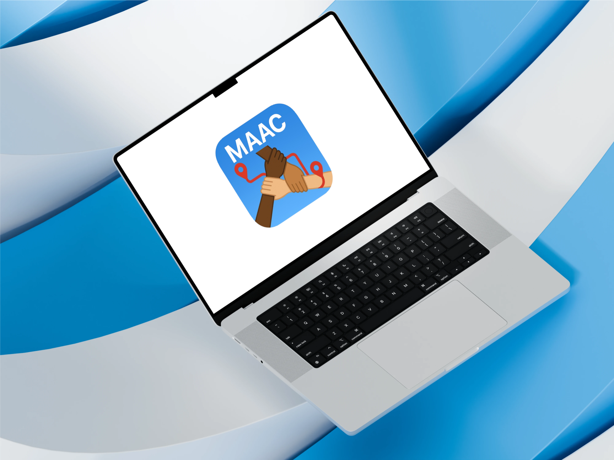

# Bem - vindo ao Mapa da Acessibilidade | Documentação

    

---

  
  
  
  
  
  

---

## 📌 Sobre o Projeto

**Mapa da Acessibilidade** é uma plataforma colaborativa que visa mapear e divulgar locais acessíveis para pessoas com deficiência ou mobilidade reduzida.

Com foco na **inclusão**, o projeto permite que qualquer pessoa contribua com informações úteis sobre espaços como praças, centros culturais, feiras e muito mais.

No seguinte site, voce irá encontrar toda **documentação** referente a seguinte **aplicação** e informações importantes sobre o seu desenvolvimento.

> 💡 Nosso lema: *"Acessibilidade não é privilégio, é direito!"*

---

## 🎯 Objetivos

- 🗺️ Um mapa interativo de locais acessíveis  
- 🙋 Permitir o cadastro e avaliação pela própria comunidade  
- 🎛️ Incluir filtros como rampa de acesso, piso tátil, banheiro adaptado  
- 🔍 Facilitar a busca por espaços acessíveis por região ou tipo de atividade  

---

## 💡 Motivação

A falta de informação é um dos maiores obstáculos enfrentados por pessoas com deficiência. Este projeto, desenvolvido por estudantes universitários, tem como missão **mudar esse cenário por meio da tecnologia e colaboração comunitária**.

---

## 🔧 Funcionalidades Principais

- 📍 Mapa colaborativo
- 📝 Cadastro e avaliação de locais
- 🎚️ Filtros personalizáveis
- 🔎 Busca inteligente
- 🗣️ Sistema de comentários e recomendações

---

## 📊 Tecnologias Utilizadas

- **Frontend**: React.js  
- **Backend**: Node.js + Express  
- **Banco de Dados**: PostgreSQL  
- **Mapa**: Leaflet API  
- **Design**: Figma  
- **Documentação**: MkDocs + Material

---

## 📜 Licença

Este projeto está sob a licença [MIT](https://github.com/unb-mds/2025-1-Squad01?tab=MIT-1-ov-file).

---

## 🧪 Protótipos e Links Úteis

- 🎨 Protótipo: [mapadaacessibilidade (Figma)](https://unb-mds.github.io/mapadaacessibilidade) 
- 🗂️ Quadro de Overview: [Canva](https://www.canva.com/design/DAGkRnxFbno/UzQqYdR57qFCH5p5HUuFVw/edit?utm_content=DAGkRnxFbno&utm_campaign=designshare&utm_medium=link2&utm_source=sharebutton)

---

## 👥 Equipe

<table>
  <tr>
    <td align="center"><a href="https://github.com/oalbertocavalcante"> <b>Alberto Cortês</b></a></td>
    <td align="center"><a href="https://github.com/code-silva"> <b>Anderson Fernandes</b></a></td>
    <td align="center"><a href="https://github.com/Maria-Laura-Regis"> <b>Maria Laura</b></a></td>
    <td align="center"><a href="https://github.com/Samuelvlobo"> <b>Samuel Rodrigues</b></a></td>
    <td align="center"><a href="https://github.com/Dexmachi"> <b>Caio Rocha</b></a></td>
    <td align="center"><a href="https://github.com/CaioSoandrd"> <b>Caio Soares</b></a></td>
    <td align="center"><a href="https://github.com/Lucas-Ricarte"> <b>Lucas Ricarte</b></a></td>
  </tr>
</table>

---

  <i>Esta documentação é parte do projeto da disciplina de Métodos de Desenvolvimento de Software da Universidade de Brasília — 2025.1</i>

