```mermaid
flowchart TD
    %% Fluxo 100% linear - uma etapa abaixo da outra
    Start["📥 Requisição HTTP"] --> 
    Routes["📂 Rotas"] --> 
    R1["🔀 acessibilidadeRouter.js"] --> 
    R2["🔀 acessibilidadeLocalRouter.js"] --> 
    R3["🔀 avaliacaoLocalRouter.js"] --> 
    R4["🔀 fotosRouter.js"] --> 
    R5["🔀 locaisRouter.js"] --> 
    R6["🔀 usuariosRoutes.js"] --> 
    Middlewares["🛡️ Middlewares"] --> 
    M1["✅ authMiddleware.js"] --> 
    M2["🚫 errorMiddleware.js"] --> 
    M3["🔐 loginMiddleware.js"] --> 
    M4["🧾 validationMiddleware.js"] --> 
    Controllers["🧠 Controllers"] --> 
    C1["🧠 acessibilidadeController.js"] --> 
    C2["🧠 acessibilidadeLocalController.js"] --> 
    C3["🧠 avaliacaoLocalController.js"] --> 
    C4["🧠 fotosController.js"] --> 
    C5["🧠 locaisController.js"] --> 
    C6["🧠 usuariosController.js"] --> 
    Database["🗄️ Banco de Dados\n(Prisma + PostgreSQL)"]
```

# 🧠 Visão Geral do Backend

O backend do projeto **Mapa da Acessibilidade** é responsável por gerenciar toda a lógica de negócio, autenticação, acesso ao banco de dados e disponibilização das rotas da API. Ele foi desenvolvido com **Node.js** utilizando o framework **Express**, adotando boas práticas de arquitetura e separação de responsabilidades entre controladores, rotas, middlewares e acesso a dados via Prisma ORM.

Entre suas principais responsabilidades estão:

* Gerenciar e disponibilizar os dados dos locais acessíveis e avaliações da comunidade.
* Validar e autenticar usuários por meio de middlewares
* Integrar com o banco de dados **PostgreSQL** via **Prisma**.
* Expor endpoints REST documentados com **Swagger**.
* Permitir o escalonamento e manutenção através de código modular.

O backend está organizado em camadas bem definidas, facilitando a leitura, manutenção e colaboração entre desenvolvedores. Cada entidade do sistema possui seus próprios controladores, rotas e testes automatizados, mantendo o projeto coeso e escalável.

> 💡 Toda a estrutura foi pensada para facilitar a colaboração open source, com padrões claros, testes e documentação integrada.

---

### Exemplo Simplificado

---

---