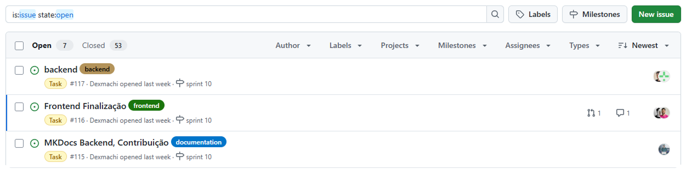
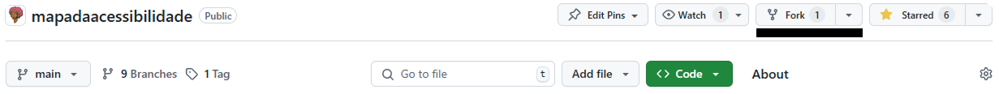

# 🤝 Como Contribuir

Este é um projeto **open source** e acreditamos que a colaboração é o caminho para torná-lo cada vez mais relevante para a comunidade. 

Siga os passos abaixo para contribuir com código, documentação ou ideias!

---

## 🧰 Tecnologias Principais | Requisitos

- **Frontend**: React.js  
- **Backend**: Node.js + Express  
- **Banco de Dados**: PostgreSQL  
- **Mapa**: Leaflet API  
- **Design**: Figma  
- **Documentação**: MkDocs + Material

---

## 🚧 Fluxo de Contribuição

1. **Encontre uma issue existente** ou crie uma nova descrevendo sua proposta.



2. **Faça um fork** do repositório: 

   [https://github.com/unb-mds/mapadaacessibilidade](https://github.com/unb-mds/mapadaacessibilidade)



3. **Clone o seu fork**:
```bash
   git clone https://github.com/seu-usuario/mapadaacessibilidade.git
   cd mapadaacessibilidade
```

4. **Crie uma nova branch descritiva**:

   ```bash
   git checkout -b feat/nome-da-sua-funcionalidade
   ```
5. **Implemente suas alterações** seguindo os padrões do projeto.
6. **Escreva testes** para garantir que sua funcionalidade está funcionando (quando aplicável).
7. **Atualize a documentação** (caso sua mudança afete alguma parte do sistema).
8. **Faça o commit com mensagem semântica**:

   ```bash
   git add .
   git commit -m "feat: adiciona componente de avaliação de acessibilidade"
   ```
9. **Faça push para seu fork**:

   ```bash
   git push origin feat/nome-da-sua-funcionalidade
   ```
10. **Abra um Pull Request (PR)** para o repositório oficial, na branch `main`.

---

## ✅ Checklist do Pull Request

* [ ] O código segue os padrões do projeto
* [ ] Testes escritos ou atualizados (se necessário)
* [ ] Documentação atualizada (se aplicável)
* [ ] PR vinculado a uma issue (use `Closes #número`)

---

## 🧑‍💻 Padrões de Código

* **Lint e formatação**: ESLint e Prettier configurados.
* **Commits semânticos**:
  Use prefixos como `feat:`, `fix:`, `docs:`, `refactor:`, etc.
* **Componentes React**: Nomeados em `PascalCase`.
* **Pastas**: Nomeadas em `kebab-case`.
* **Estilos**: Usamos **Tailwind CSS** sempre que possível.
* **Testes**: Testes unitários e/ou de integração para novas funcionalidades.

---

## 🧪 Configuração Local

### Backend

```bash
cd app/backend
pnpm install
pnpm dev
```

### Frontend

```bash
cd app/frontend
pnpm install
pnpm dev
```

> 💡 Certifique-se de ter o PostgreSQL rodando localmente com as credenciais adequadas.

---

## 📄 Documentação (MkDocs)

A documentação está disponível via MkDocs e pode ser atualizada localmente com:

```bash
# Instale as dependências Python (em um ambiente virtual)
python -m venv venv
.\venv\Scripts\Activate  # ou source venv/bin/activate no Linux/Mac
pip install -r requirements.txt

# Rode localmente
mkdocs serve
```

Acesse [http://127.0.0.1:8000](http://127.0.0.1:8000) para visualizar localmente.

---

## 🧪 Testes

* Utilize o framework de testes configurado no projeto (`Jest`, `Vitest`, ou equivalente).
* Tente manter pelo menos 80% de cobertura para novas funcionalidades.

---

## 🏷️ Labels úteis

| Label              | Descrição                                |
| ------------------ | ---------------------------------------- |
| `bug`              | Algo que não está funcionando            |
| `feature`          | Nova funcionalidade                      |
| `documentation`    | Atualizações na documentação             |
| `enhancement`      | Melhoria em algo já existente            |
| `help wanted`      | Procurando ajuda da comunidade           |
| `good first issue` | Ideal para novos contribuidores          |
| `question`         | Dúvidas sobre o funcionamento do projeto |

---

## 🫂 Código de Conduta

Este projeto adota um **código de conduta** baseado em respeito, inclusão e empatia. Qualquer violação pode ser reportada aos responsáveis do repositório.

---

## 💬 Dúvidas?

Abra uma **issue com a label `question`** ou entre em contato com a equipe pelo canal oficial.

---

Agradecemos por contribuir com o Mapa da Acessibilidade 💜

---


